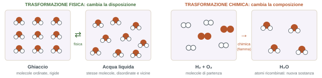
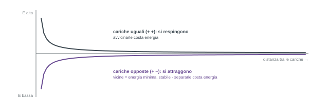

## Come funziona il corso

### Chi è chi

| Ruolo | Nome | Contatto |
| --- | --- | --- |
| Docente | prof. Pavlo Solokha | pavlo.solokha@unige.it |
| Tutor didattico | Marco Riviera, quasi laureato in chimica | riviera.marco4@gmail.com |
| Responsabile laboratorio GEO | prof. Lorenzo Degli Esposti | lorenzo.degliesposti@unige.it |
| Responsabile laboratorio Biotech | prof. Valerio Voliani | valerio.voliani@unige.it |
| Tecnico di laboratorio | dott. Walter Sgroi | walter.sgroi@unige.it |

Per tutte le domande sul laboratorio il prof chiede di scrivere ai responsabili del laboratorio (lui può essere messo in copia).

### Orari e aule

- **Lezioni**: lunedì 11–13, mercoledì 11–13, venerdì 9–11, sempre in **Aula 2, ex Saiwa**. Il prof di solito non fa pausa; nelle lezioni 11–13 preferisce finire un po' prima per chi deve prendere i mezzi.
- **Lunedì 5 ottobre**: l'edificio è chiuso per un concorso, la lezione si fa al **Dipartimento di Chimica (DCCI)**, via Dodecaneso.
- **Mercoledì 7 ottobre**: lezione **annullata** (visita medica del prof). Arriverà un avviso su Aulaweb.
- Corso dal 2 ottobre 2026 al 15 gennaio 2027. Per Geologia si parte solo ora perché, essendo un corso mutuato, si è dovuto allineare all'inizio di Biotecnologie.
- Il prof chiede di sedersi davanti: chi arriva prima prende il posto.

### Strumenti online

| Strumento | Accesso | A cosa serve |
| --- | --- | --- |
| Aulaweb | corso 87055 · chiave **chimica** · 2026.aulaweb.unige.it/course/view.php?id=3586 | avvisi a tutti gli iscritti, turni di laboratorio, esiti degli scritti, slide, esercizi, test di preparazione al laboratorio. È il canale principale |
| Teams | codice **kquw61o** | lezioni online solo in caso di allerta rossa (il prof ha detto che lo userà il meno possibile). Con allerta arancione le attività di laboratorio non si fanno |
| Wooclap | wooclap.com/RFHEIX | foglio firme (il codice resta sempre lo stesso) e attività interattive |

Programma e scheda del corso: corsi.unige.it/off.f/2026/ins/96754.

## Il laboratorio

:::esame{etichetta="Da segnare subito"}
**Inizio: martedì 17 novembre.** Per Scienze Geologiche il **martedì pomeriggio, 16–18** (turno in verde nella tabella). Biotecnologie ha lunedì e giovedì. Fino al 17 novembre ignorare i laboratori che compaiono al pomeriggio su EasyAcademy: il sistema non riflette il calendario reale.

**Frequenza obbligatoria al 100%** per Geologia (per le lezioni l'obbligo è stato abolito). **Senza tutte le esperienze di laboratorio non si è ammessi allo scritto**, per tutto l'anno accademico.
:::

- **Dove**: Dipartimento di Chimica (DCCI), via Dodecaneso, a piedi dal DISTAV (via Papigliano e la passerella, ultimo palazzo a sinistra). Si entra al sesto piano e si scende ai laboratori.
- **Corso sicurezza**: 4 ore online + 8 ore in presenza, obbligatorio prima di entrare. Il prof chiederà l'elenco di chi l'ha completato: senza attestato non si entra. Per Geologia lo gestisce Piazza, ed è lo stesso che serve per le uscite sul terreno.
- **Assenze**: se si salta per un motivo valido (malattia, sport) bisogna avvisare e spiegare. Si può essere inseriti in un gruppo parallelo nella stessa settimana, e ci sono alcune sedute di recupero. Il prof ha insistito: il problema degli anni scorsi è stato chi spariva senza giustificare né recuperare, e poi si lamentava di non essere ammesso.
- Su Aulaweb ci saranno anche test e attività preparatorie al laboratorio.

## Il tutorato

Con Marco Riviera, **martedì 14–16**, dal **13 ottobre**, in **aula B1.02** della Palazzina delle Scienze (DISTAV), quella a un piano solo tra Corso Europa e viale Benedetto XV. Prima dell'inizio del laboratorio è l'unico pomeriggio libero per entrambi i corsi.

Marco lavora in coppia con il prof: sa cosa è stato spiegato in aula e prepara gli esercizi di conseguenza. Il tutorato non è obbligatorio, ma il prof ha chiesto esplicitamente di andarci: "i risultati finali sono disastrosi", con **meno del 10%** che supera l'esame. Anche lì si rilevano le presenze.

## Esame e metodo di studio

:::esame{etichetta="L'esame"}
Solo **scritto**, niente orale. Circa **metà punteggio esercizi** e **metà domande teoriche a risposta aperta**. Crocette praticamente mai. Con almeno **18/30** si può accettare il voto. Ammessi solo con tutte le esperienze di laboratorio fatte.
:::

- **Studiare subito dopo ogni lezione**: un ripasso di uno o due giorni prima dell'esame non basta. La chimica va di pari passo con gli esercizi.
- Gli appunti del prof su Aulaweb (il PDF della prima lezione è già lì) sono "la carcassa": non bastano per l'esame. Serve il libro, soprattutto per la teoria.
- Anche gli esercizi su Aulaweb sono il **minimo indispensabile**: farli tutti non vuol dire essere pronti. Bisogna farne altri dai libri.
- Il punto debole che il prof vede più spesso: non capire il testo del problema, prima ancora della chimica. E saper scrivere il ragionamento in modo chiaro, anche con una calligrafia leggibile.
- I crediti non sono solo ore in aula: comprendono lo studio autonomo, e per chimica ne serve molto, anche il doppio delle ore di lezione.

### Libri

Nessun testo obbligatorio: va bene qualunque chimica generale universitaria, e **un'edizione di qualche anno fa va benissimo** (le nuove costano due o tre volte tanto e il contenuto cambia poco). Gli argomenti sono quelli standard: teoria acido-base, equilibrio, stechiometria.

| Testo | Commento del prof |
| --- | --- |
| Silberberg, Amateis, *Chimica* (McGraw-Hill) | Livello adatto a Geologia e Biotech. Esercizi a fine capitolo, negli ultimi anni con soluzioni |
| Chang, Overby, *Fondamenti di chimica generale* (McGraw-Hill) | Livello adatto a Geologia e Biotech. Esercizi a fine capitolo, negli ultimi anni con soluzioni |
| Petrucci et al., *Chimica generale* (Piccin) | Un po' più complicati, livello da corso di laurea in Chimica |
| Bertini, Luchinat, Mani, *Chimica* (CEA) | Un po' più complicati, livello da corso di laurea in Chimica |
| Atkins, Jones, *Principi di chimica* (Zanichelli) | Un po' più complicati, livello da corso di laurea in Chimica |
| Atkins, Jones, Laverman, *Fondamenti di chimica generale* (Zanichelli) | Un po' più complicati, livello da corso di laurea in Chimica |
| Bertini, Luchinat, Mani, *Stechiometria* (CEA) | Solo esercizi. Un po' vecchi, ma con esercizi più che sufficienti |
| Michelin Lausarot, Vaglio, *Stechiometria per la chimica generale* (Piccin) | Solo esercizi. Un po' vecchi, ma con esercizi più che sufficienti |
| Michelin Lausarot, Vaglio, *Fondamenti di stechiometria* (Piccin) | Solo esercizi. Un po' vecchi, ma con esercizi più che sufficienti |

*Per chi ama leggere: Oliver Sacks, *Zio Tungsteno*; Le Couteur e Burreson, *I bottoni di Napoleone*; Roald Hoffmann, *La chimica allo specchio*.*

## Che cos'è la chimica

Tutto quello che abbiamo intorno è materia, e i materiali sono il risultato anche dello sviluppo della chimica: salute e medicina (farmaci, vaccini, anestesia, depurazione), energia e ambiente (combustibili, solare, nucleare), cibo e agricoltura (fertilizzanti, conservanti), materiali (polimeri, ceramiche, batterie, quantum dots). "Un geologo che non si orienta nelle formule non sa di cosa sono fatti i minerali, e non è un geologo."

:::definizione
La **chimica** studia la materia, le sue proprietà, le trasformazioni che subisce e l'energia associata a queste trasformazioni.

**Materia**: qualsiasi cosa occupi spazio e sia dotata di massa. Anche l'aria, che non vediamo, perché è fatta di atomi che hanno una massa.

**Sostanza**: forma di materia con composizione definita e proprietà distinte. L'analogia del prof: gli atomi sono le lettere, le sostanze sono le parole.

**Proprietà**: le caratteristiche che danno a ciascuna sostanza la sua identità. **Fisiche**: quelle che la sostanza ha di per sé, senza trasformarsi (colore, temperatura di fusione e di ebollizione, densità). **Chimiche**: quelle che mostra quando si trasforma in un'altra sostanza o interagisce con essa (infiammabilità, corrosività). Le proprietà fisiche si dividono poi in intensive ed estensive.
:::

### Trasformazioni fisiche e chimiche

- **Fisica**: non altera composizione e identità della sostanza. Ghiaccio, acqua liquida e vapore sono sempre H₂O: cambia solo come sono disposte le molecole. Esempi: fusione del ghiaccio, ebollizione dell'acqua della pasta, zucchero sciolto in acqua. Di solito è **reversibile** cambiando solo la temperatura: un cambiamento di stato è sempre una trasformazione fisica.
- **Chimica**: cambia la composizione. Le molecole si rompono negli atomi e gli atomi si ricombinano in modo diverso. Esempi: idrogeno e ossigeno che, innescati da una fiamma, formano acqua; il metano del fornello (CH₄) che brucia con l'ossigeno dando CO₂ e acqua. Non si inverte cambiando solo la temperatura: per scomporre l'acqua in idrogeno e ossigeno serve l'**elettrolisi**, cioè energia elettrica.
- Le reazioni chimiche sono spesso accompagnate da un grosso scambio di energia: la formazione dell'acqua è fortemente **esotermica** (rilascia molto calore), la sua scomposizione richiede che l'energia venga fornita dall'esterno.

:::nota{etichetta="L'acqua è un'eccezione"}
Quasi tutte le sostanze sono più dense da solide che da liquide; l'acqua fa il contrario. Nel ghiaccio le molecole sono organizzate in una struttura rigida e voluminosa; nel liquido la struttura collassa e le molecole si avvicinano. Per questo il ghiaccio galleggia e esistono gli iceberg. A pressioni molto elevate anche il ghiaccio può diventare più denso (interessa ai geologi: carote di ghiaccio, ghiacciai). **\[ndr\]** Il prof l'ha definita una proprietà quasi unica: lo stesso comportamento lo mostrano anche gallio, bismuto, silicio e germanio.
:::

### Gli stati della materia, visti dagli atomi

**Solido**: forma e volume propri. **Liquido**: volume proprio, prende la forma del recipiente e forma una superficie. **Gas**: occupa tutto lo spazio disponibile, senza superficie. A livello atomico: nel solido le molecole sono ordinate in file, nel liquido sono vicine ma in disordine, nel gas sono lontanissime ("se nel liquido sono vicine come voi seduti ai banchi, nel gas uno è qui e l'altro alla stazione").

## L'energia

:::definizione
**Energia**: la capacità di compiere lavoro. **Energia potenziale**: quella che un corpo possiede per la sua posizione. **Energia cinetica**: quella che possiede per il suo movimento. **Energia totale = potenziale + cinetica.**

L'energia non si crea né si distrugge: si **conserva** e si converte da una forma all'altra. Gli stati a energia più bassa sono **più stabili** e favoriti.
:::

È un concetto che il prof chiede di tenere sempre in testa: l'energia è "sempre" il fattore che decide cosa si ottiene in una trasformazione. In natura avviene ciò che è più conveniente dal punto di vista energetico.

- **Il cellulare**: fermo sul banco o tenuto più in alto ha solo energia potenziale, ma più in alto ne ha di più (rispetto al centro della Terra). Lasciato cadere, la potenziale si converte in cinetica: da più in alto l'urto è più violento.
- **Mosca ed elefante**: la mosca è veloce ma leggera, l'elefante lento ma enorme. Lo stesso vale per atomi diversi, dal piccolo idrogeno al grosso uranio.
- **La molla**: a riposo ha l'energia più bassa; allungarla o comprimerla costa lavoro e ne alza l'energia.
- **Il carburante, l'esplosivo, il cibo**: l'energia chimica accumulata in una sostanza si libera con una reazione. Una saponetta di esplosivo, un reattore nucleare, un pezzo di lardo contro un popcorn della stessa dimensione: il contenuto energetico è molto diverso. Il petrolio è energia accumulata nel sottosuolo dalla decomposizione di piante nel corso di **\[ndr: milioni, non migliaia di\]** anni.

### Energia e cariche

Molti fenomeni chimici si spiegano con l'interazione elettrostatica tra specie cariche (cationi e anioni). Cariche opposte si attraggono perché, avvicinandosi, l'energia totale diminuisce; cariche uguali si respingono perché avvicinarle la aumenterebbe. Separare due cariche opposte richiede energia, e più le allontano più ne serve. È lo stesso principio dei cambiamenti di stato: per far evaporare l'acqua bisogna allontanare le molecole, quindi fornire energia (il fornello); quando il vapore condensa l'energia viene rilasciata (è il principio dei condizionatori).

## Gli elementi

:::definizione
**Elemento**: sostanza che non può essere separata in sostanze più semplici con mezzi chimici. La slide ne conta 114, di cui 82 presenti in natura (oro, alluminio, piombo, ossigeno, carbonio) e 32 creati dagli scienziati (tecnezio, americio, seaborgio). **\[ndr\]** Il dato è vecchio: oggi gli elementi riconosciuti sono **118**.
:::

- **I simboli** hanno al massimo due lettere, e la **prima è sempre maiuscola**. Co è il cobalto; CO, con due maiuscole, è un composto di carbonio e ossigeno. Molti simboli vengono dalla radice del nome latino: Cu rame, Fe ferro, Au oro, Sn stagno.
- **Abbondanza**: oltre il 95% in peso della Terra è fatto da circa 10 elementi; oltre il 95% dell'Universo da 2 soli, idrogeno ed elio. **\[ndr\]** In aula "99% idrogeno, elio al 4%": in massa sono circa 74% idrogeno e 24% elio. Gli elementi più pesanti si formano solo con fenomeni estremi (stelle giganti, fusioni nucleari, collisioni tra stelle). Uno smartphone ne contiene più di 30, tra cui molti di importanza strategica.
- Tavola periodica consigliata: **ptable.com** (anche in italiano, passando col mouse si vedono nome e proprietà).

:::esame{etichetta="Compito per casa"}
Imparare a memoria **nome e simbolo** degli elementi con numero atomico **1–30, 35–38, 47, 53–56, 78, 79**. In pratica le prime 3–4 righe della tavola periodica, più qualche elemento noto più in basso (argento, iodio, platino, oro). Per ora niente proprietà, configurazioni elettroniche o isotopi: arrivano più avanti.
:::

## Da fare

- [ ] Iscriversi su Aulaweb (corso 87055, chiave "chimica") e su Teams (codice kquw61o).
- [ ] Segnare: lunedì 5 ottobre lezione al Dipartimento di Chimica; mercoledì 7 ottobre niente lezione.
- [ ] Segnare il tutorato: martedì 14–16, aula B1.02, dal 13 ottobre.
- [ ] Segnare l'inizio del laboratorio: martedì 17 novembre, 16–18, al DCCI.
- [ ] Verificare di avere l'attestato del corso sicurezza (4 h online + 8 h in presenza).
- [ ] Imparare nome e simbolo degli elementi 1–30, 35–38, 47, 53–56, 78, 79.
- [ ] Scegliere un libro, anche di un'edizione vecchia o in prestito.
- [ ] Ridisegnare lo schema fisico/chimico a livello atomico.
