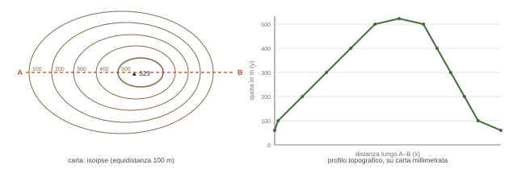
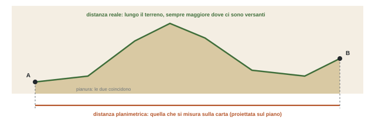

## Come funziona il corso

*Un corso da 6 CFU, solo nel primo semestre. Si parte dalla cartografia, che serve a tutto il resto.*

### Orari e aule

|  | Fino al 31 ottobre | Dal 2 novembre |
| --- | --- | --- |
| Lunedì | 16–18 · CT.09 | 16–18 · CT.09 |
| Mercoledì | 9–11 · CT.09 e 14–16 · B1.01 | 16–18 · B1.01 |
| Giovedì | 14–16 · CT.09 | 16–18 · CT.09 |

- Niente gruppi: **tutte le lezioni del calendario valgono per tutti**.
- **Giovedì 1 ottobre la lezione è annullata.** Prossima lezione: **lunedì 5 ottobre, 16–18, CT.09**.
- Le lezioni finiscono prima di Natale o subito dopo, prima della pausa esami di metà gennaio.
- L'idea del prof: iniziare puntuali e fare un'ora e mezza piena, per poi chiudere un po' prima. "Non scappate a prendere i treni", soprattutto i levantini.
- Il prof ha chiesto una chat di classe per comunicare in fretta, anche per le escursioni.

### Obiettivi

La geografia fisica, con il supporto della cartografia, deve dare le basi per **leggere il paesaggio** e capirne l'evoluzione, analizzando le relazioni tra **atmosfera, litosfera e idrosfera** e l'influenza dell'uomo su queste componenti e sul modellamento del paesaggio. In pratica: saper leggere le carte topografiche per interpretare e misurare le forme del terreno, e collegare i fenomeni atmosferici alla distribuzione dei climi.

Perché si parte dalla carta: se non sai usare una carta non puoi andare sul terreno a fare un rilevamento, che sia geologico, geomorfologico, idrogeologico, petrografico o mineralogico. La carta topografica è la base su cui poi si costruiscono tutte le carte tematiche (geologiche, geomorfologiche, idrogeologiche). E il confronto tra carte di epoche diverse, anche di 100–200 anni fa, permette di ricostruire l'evoluzione del paesaggio: frane, linea di costa che arretra per erosione o avanza per l'apporto dei fiumi, e così via.

:::nota{etichetta="Carta a mano, prima del GIS"}
I **GIS** (Geographic Information Systems, sistemi informativi geografici) sono i software con cui lavora chiunque si occupi di territorio: geologi, ingegneri, architetti. Ci si caricano carte **georeferenziate**, cioè con ogni punto associato alle sue coordinate e alla quota, su cui si calcolano distanze, superfici, pendenze e si costruiscono modelli tridimensionali del terreno. In questo corso però si lavora "come una volta", a mano. Non è inutile: se non si capiscono i principi, si fanno gli stessi errori anche sul software. Al programma bisogna dare le informazioni giuste e fare le domande giuste.
:::

## Il programma

### Cartografia (fino a fine ottobre)

- Carte e **concetto di scala**, numerica e grafica.
- Le **proiezioni geografiche**; forma e dimensioni della Terra. Serve anche per capire cosa chiede un GIS quando domanda "che sistema di riferimento usi?": dipende dalla forma e dalle dimensioni della Terra adottate per costruire quella carta.
- Il **simbolismo cartografico** e i principi di costruzione di una carta.
- La posizione di un punto: il reticolato geografico, **coordinate geografiche, chilometriche e polari**. Il prof ha insistito: è uno dei punti chiave, e le due coordinate vengono spesso confuse. Bisogna saper leggere le coordinate di un punto sulla carta e, al contrario, trovare sulla carta il punto di cui si hanno le coordinate: "se sbagliate il punto, fate il sondaggio nel posto sbagliato".
- **Nord geografico, nord magnetico, nord reticolato** e declinazione magnetica.
- Classificazione delle carte.
- Rappresentazione del rilievo: le **curve di livello** (isoipse) e il **profilo topografico**.
- Il sistema cartografico internazionale **UTM** e la produzione cartografica italiana.

### Geografia fisica (da novembre)

- Composizione e struttura verticale dell'atmosfera.
- Tempo atmosferico e clima.
- Radiazione solare e variazioni spaziali e stagionali del riscaldamento.
- Pressione atmosferica, venti, circolazione atmosferica generale.
- Umidità, evaporazione, condensazione, precipitazioni.
- Masse d'aria, fronti, perturbazioni.
- Classificazione dei climi e il clima in Italia.
- Cenni sul sistema marino e sulle acque continentali (si approfondiscono negli anni successivi).

## Cartografia: un'anteprima

### Le carte che si useranno

Carte topografiche IGMI al **25.000** e carte tecniche regionali (**CTR** della Regione Liguria) al 10.000 e 5.000. Nelle slide anche esempi di carte nautiche, catastali e uno stralcio della carta geomorfologica del Promontorio di Portofino al 5.000.

:::definizione
**IGMI**: Istituto Geografico Militare Italiano, "IGM" per confidenza. Ha prodotto la cartografia di tutto il territorio italiano a partire dall'Unità d'Italia. Oggi l'aggiornamento è passato in gran parte alle Regioni, con le carte tecniche regionali. **\[ndr\]** L'istituto prende il nome di Istituto Topografico Militare nel 1872 e diventa Istituto Geografico Militare nel 1882.

**Curve di livello** (isoipse): linee che uniscono punti alla stessa quota. È il metodo di rappresentazione del rilievo usato da circa un secolo. Dall'andamento delle curve e dalle quote assegnate si ricostruisce la forma del terreno: valli, crinali, versanti più o meno inclinati, zone pianeggianti.

**Profilo topografico** (sezione topografica): un diagramma cartesiano con le distanze sull'asse x e le quote sull'asse y, che ricostruisce l'andamento del rilievo tra un punto A e un punto B.
:::

L'obiettivo è arrivare a guardare la carta "come una fotografia dall'aereo", vedendo il terreno in tre dimensioni. È anche il modo di preparare un'uscita: prima di andare sul terreno si studia la carta, si decide dove rilevare, si individuano strade e sentieri.

### Pendenza e inclinazione

Due grandezze diverse. L'**inclinazione** si esprime in gradi (un piano orizzontale è a 0°, una parete verticale a 90°). La **pendenza** si esprime in percentuale. Contano molto per il geologo: la pendenza è un fattore predisponente all'**instabilità di un versante**. Una frana non avviene in pianura, avviene su un versante, perché la gravità tende a portare il materiale verso il basso.

### Distanze e aree: la carta è piatta, il terreno no

Sulla carta si misura la distanza **planimetrica**, cioè proiettata sul piano, e la si converte con la scala (10 cm su una carta al 10.000 fanno 1 km). Coincide con quella reale solo in pianura. Se tra A e B c'è un versante da salire e scendere, la distanza che percorreresti è maggiore, e la si può calcolare dal profilo topografico: magari da 1 km si passa a 1,3. Stesso discorso per le aree: un bacino che sulla carta misura 5 km², se è articolato in valli e versanti, in realtà può arrivare a 6–7 km². I GIS invece, lavorando sul modello tridimensionale, danno direttamente la distanza reale.

### La carta di Rapallo

Il prof ha dato a ciascuno 4 fotocopie che insieme compongono una tavoletta IGM. Si numerano **1, 2, 3, 4 in senso orario** partendo da quella in alto a sinistra. Vanno portate **sempre** alle lezioni di cartografia. È una carta rilevata circa 80 anni fa: morfologia e soprattutto uso del suolo sono diversi da oggi, e per la didattica il prof la preferisce alle carte nuove, che si basano sugli stessi principi.

:::definizione{etichetta="Riferimenti della carta"}
**Carta d'Italia 1:25.000, Foglio 83, Quadrante II, Tavoletta SO: "Rapallo"** · Serie M891, Edizione 2 · IGMI.

"M891" è la sigla della **Serie 25/V** dell'IGM, le vecchie "tavolette": 3545 carte al 25.000 che coprono tutta l'Italia, rilevate in gran parte per via aerofotogrammetrica, con isoipse a equidistanza di 25 m, proiezione Gauss-Boaga, produzione e aggiornamento conclusi nel 1990. Ogni tavoletta misura 5' in latitudine per 7'30" in longitudine, circa 96 km².

Come si legge la sigla: il **Foglio** (qui 83) si divide in 4 **Quadranti** al 50.000 numerati I–IV; ogni quadrante si divide in 4 **Tavolette** al 25.000 indicate con NE, SE, SO, NO.

Dove trovarla: nel catalogo IGM (igmi.org) la *083 II-SO (Rapallo)* è in vendita come riproduzione in bianco e nero di un'edizione del 1933. Le carte IGM al 25.000 si consultano gratis anche dal Geoportale Nazionale, pure in QGIS tramite servizio WMS (wms.pcn.minambiente.it). Nella cartografia regionale la tavoletta "Rapallo" non esiste: la zona sta nella carta "Chiavari", perché cambia il taglio dei fogli.
:::

Per la cartografia regionale si può usare il Geoportale della Regione Liguria, con carte topografiche dal 5.000 al 100.000 e carte geologiche scaricabili in formato digitale. L'archivio cartaceo è anche disponibile in dipartimento.

## Geografia fisica: un'anteprima

:::esame{etichetta="Errore da non fare"}
**Tempo atmosferico non è clima.** "Oggi è sereno, poco ventoso, 20 gradi": questo è il tempo, cioè le condizioni del momento, descritte dagli **elementi atmosferici** (temperatura, precipitazioni, umidità, vento, pressione). Il **clima** è quello che si ottiene quando queste condizioni si ripetono nelle stagioni e negli anni in una certa area. "Il clima di oggi", come si sente in televisione, non ha senso.
:::

La Liguria non ha un clima ma tanti: più mite sulla costa, diverso nell'entroterra e in quota. L'Italia, dal Trentino alla Sicilia, ha una grande escursione di latitudine, e Alpi e Appennini fanno da confine tra regioni climatiche diverse.

I legami da avere in testa fin da subito:

- **Temperatura → pressione**: zone più calde hanno pressioni al suolo più basse, zone più fredde pressioni più alte.
- **Pressione → vento**: il vento nasce da una differenza di pressione, e l'aria si sposta dalle alte verso le basse pressioni. Da qui la circolazione atmosferica generale.
- **Umidità → condensazione → precipitazioni**, che non sono solo pioggia. La quantità di precipitazioni negli anni distingue climi umidi, secchi, aridi.
- **Masse d'aria calde e fredde → fronti → perturbazioni e cicloni**. Quelli delle medie latitudini ci interessano da vicino; quelli tropicali sono più energetici. Si parla di "tropicalizzazione" del Mediterraneo, perché i nostri cicloni extratropicali cominciano ad assumere caratteristiche quasi tropicali.

Il clima condiziona poi il modellamento del rilievo: sarà il tema di Geomorfologia il prossimo anno. E l'uomo interviene in modo sempre più pesante: l'espansione degli insediamenti in aree dove non si sarebbe dovuto costruire aumenta i rischi alluvionali e da frana.

## Esercitazioni ed esame

### Le esercitazioni

In aula, con carte IGMI al 25.000 e CTR al 10.000 e 5.000. Riconoscere le curve di livello e le forme del rilievo, costruire profili topografici, determinare la quota di un punto, calcolare pendenza e inclinazione, misurare distanze e aree alle diverse scale, calcolare coordinate geografiche e chilometriche (UTM, Gauss-Boaga). Per la geografia fisica, meno quantitativa, qualche calcolo su dati meteorologici e climatici.

### L'esame

- **Scritto**: domande sugli argomenti, calcoli (coordinate, pendenza e inclinazione di un versante, aree, distanze), sezioni topografiche per la cartografia; grafici e disegni schematici per la geografia fisica. Superato con almeno **18/30**.
- **Orale**: discussione dello scritto e domande su altri argomenti del corso. Si può fare nello stesso appello dello scritto o in quelli successivi.
- Voto finale: **media aritmetica** tra scritto e orale.
- Appelli: 2 nella sessione invernale (gennaio–febbraio), 4 in quella estiva (giugno, luglio, settembre).

:::esame{etichetta="La strada consigliata: le prove in itinere"}
Per chi frequenta lo scritto si può sostituire con **due prove**: una di **cartografia**, a inizio novembre, finita quella parte, e una di **geografia fisica**, verso la fine delle lezioni. Vanno superate **entrambe con almeno 18**: non si compensa un 30 con un 10. La loro media è la base del voto finale, che si chiude con un breve orale (una decina di minuti, un paio di domande) in uno dei due appelli di gennaio–febbraio. Il prof prevede anche un recupero. In sostanza, seguendo e facendo le prove si arriva all'esame già fatto al 75–80%.
:::

### Libri di testo

- T. L. McKnight, D. Hess, *Geografia fisica. Comprendere il paesaggio*, ed. italiana a cura di F. Dramis, Piccin, 2005.
- A. N. Strahler, *Geografia fisica*, Piccin, 1984.
- U. Sauro, M. Meneghel, A. Bondesan, B. Castiglioni, *Dalla carta topografica al paesaggio*, ZetaBeta, 2005.

## Da fare

- [ ] Iscriversi al corso su Aulaweb (il prof l'ha attivato in aula) e far iscrivere chi non c'era.
- [ ] Numerare le 4 fotocopie della carta di Rapallo (1-2-3-4 in senso orario dall'alto a sinistra) e portarle sempre.
- [ ] Da lunedì 5 ottobre, portare sempre l'astuccio: matita, gomma, temperino, righello, **due squadrette**, **matite colorate blu e rossa** (blu per il reticolo idrografico, rosso per i crinali; **niente biro**, perché se sbagli non si cancella), qualche foglio di **carta millimetrata**, calcolatrice scientifica (va bene quella del telefono, serve per la trigonometria di pendenze e inclinazioni).
- [ ] Fissare la differenza tra tempo atmosferico e clima.

### Prossima lezione

Lunedì 5 ottobre, 16–18, CT.09. Si comincia la cartografia, carta alla mano: cos'è una carta topografica e il concetto di scala.
