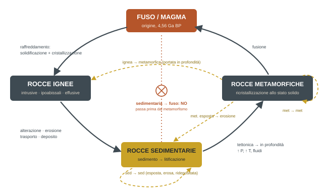

## Come funziona il corso e l'esame

*La prima mezz'ora è stata dedicata a regole che valgono per tutto l'anno. Vale la pena tenerle a portata di mano.*

### Struttura del corso

Geologia 1 è articolata in *due moduli* tenuti da due docenti: il **Modulo 1**, di geologia strutturale, tenuto dalla prof.ssa Laura Federico, e il **Modulo 2**, di geologia stratigrafica, tenuto dal prof. Michele Piazza (la lezione di oggi). I due moduli raccolgono i concetti di base della geologia e vogliono portare tutti alla stessa base di cultura geologica necessaria per arrivare al secondo e terzo anno. Obiettivo dichiarato: arrivare al punto in cui questi concetti sembrano la cosa più normale del mondo.

:::esame
**Esame unico**: i due moduli si sostengono insieme, nella stessa sessione, mai separati. Nessuna prova intermedia, nessun compito, nessuna verifica in itinere. Gli appelli partono da **giugno**; il calendario esce a fine periodo didattico (indicativamente 5–8 giugno) e da lì ci si iscrive.

**Parte pratica** (vincolante): esercizi sui temi di entrambi i moduli e **riconoscimento di tre campioni di roccia**, presi dallo stesso set che si usa in aula e in laboratorio. Chi non supera la pratica non accede all'orale.

**Parte teorica** (orale): su entrambi i moduli. Se i candidati sono pochi, tutto nello stesso giorno; se sono tanti, prima tutti la pratica, poi si programma l'orale per non sovrapporsi ad altri esami.

**Ripasso rocce**: prima di ogni tornata d'esame i docenti mettono a disposizione per 4 ore tutto il materiale usato all'esame, con assistenza, per rinfrescare il riconoscimento.
:::

### Propedeuticità e priorità

Geologia 1 vincola Geologia 2 (secondo anno), e tutti gli esami del primo anno vincolano quelli del terzo. Il docente è stato netto: gli ostacoli veri del percorso non sono le geologie ma **matematica, fisica e chimica**. Consiglio esplicito: dare priorità a queste tre, seguire tutte le esercitazioni e i sostegni, non dare nulla per scontato e chiuderle il prima possibile, così da arrivare al secondo e terzo anno con le spalle libere.

### Comunicazioni varie

- Il docente è al suo **ultimo anno di insegnamento**: va in pensione il 1° novembre 2027. Si è impegnato a restare in commissione per chi ha seguito il corso con lui, anche dopo. Il collega che lo sostituirà farà le stesse cose.
- Tiene la mascherina in aula per motivi personali di salute: parlerà con pause per prendere fiato, non è un segnale di attesa.
- **Frequenza**: le firme si raccolgono solo a chimica, dove serve l'80% di presenza in laboratorio per accedere all'esame. Al primo anno esiste il *progetto matricole*: tutor che contattano chi smette di frequentare per capire se serve aiuto.
- Parlare con i colleghi del secondo e terzo anno per le cose pratiche di gestione quotidiana (dove trovare i materiali, come funzionano le cose): semplifica la vita.
- **Testi**: i riferimenti sono indicati sul sito del corso, sia per la parte stratigrafica sia per quella sul tempo geologico. Sono testi adottati anche altrove, difficili da acquistare ma reperibili in biblioteca.

## Attrezzatura da campo ed escursioni

*Dotarsi progressivamente da qui all'inizio del secondo semestre. La regola: non bello, funzionale.*

| Oggetto | Indicazioni del docente |
| --- | --- |
| Taccuino | Formato tascabile, **copertina rigida**. Deve stare in tasca e resistere. |
| Martello da geologo | Peso attorno al **chilo** (900–1000 g): i martelli da mezzo chilo schiacciano le nocche e non servono a nulla. Acciaio dedicato, testa con punta o con taglio piatto (il piatto fa più cose). Impugnatura in legno o plastica, **non in cuoio**: bella, ma si rovina facilmente. Quello "da regalo" costa circa 150 €; va bene anche uno più economico purché sia un martello da geologo e non da carpentiere o muratore. Quando li avrete in mano il docente spiegherà, martello per martello, quali sono i punti pericolosi. |
| Guanti | Un paio di guanti da lavoro. |
| Rete protettiva | Una normale rete (o sacchetto a rete) in cui infilare il campione prima di colpirlo, così le schegge restano dentro. Il docente insegnerà come si usa. |
| Lente | Va tenuta **vicino all'occhio** e si cerca il fuoco muovendo l'oggetto, non la lente. |
| Punta per la durezza | Punta d'acciaio a durezza nota, qualunque formato: serve per il riconoscimento speditivo della durezza di rocce e minerali. Si trova a circa 5 € in una buona ferramenta; farsi consigliare dai colleghi del secondo anno. |
| Dotazioni fornite | Gilet alta visibilità e altri DPI li porta il docente (la settimana prossima); ieri verificava se la fornitura era arrivata. |

### Escursioni

- Le uscite sono aperte a tutti; la parte sicurezza è già stata trattata.
- **Prima escursione**: ultimi giorni di ottobre, data da definire, in **area protetta**. Niente martello, perché lì non si può battere: servono lente, punta e taccuino, si lavora osservando.
- **Seconda escursione**: "scuola di martello". Tutti col martello, per prendere confidenza con lo strumento battendo su rocce indicate.
- Ogni volta il docente dice cosa portare. Al primo anno l'uscita è sempre con un numero elevato di accompagnatori.

## Metodo di studio

*Poca memoria, molta tecnica, molto disegno.*

:::disegna{etichetta="Disegnare, sempre"}
Tutto quello che si studia va **ridisegnato a mano**: bello o brutto non importa. Disegnando si è costretti a prendere coscienza di ciò che si sta facendo e si verifica di aver capito. All'esame verrà chiesto di disegnare, ad esempio il ciclo delle rocce. "Non so disegnare" non è una risposta: nessuno è disegnatore, tutti sono in grado di fare uno schizzo con gli elementi fondamentali.
:::

- **Memoria al minimo.** Non si supera un esame di riconoscimento imparando a memoria: si imparano le *tecniche e i modi* con cui si procede per riconoscere una roccia e risolvere gli esercizi.
- **Definizioni ben fatte.** Una definizione precisa di un concetto vale molto, non nelle parole del docente ma con un linguaggio tecnico e scientifico. Non "una superficie tipo che…" ma "una superficie che fa questo, questo e questo".
- **Sintesi e terminologia.** Il ragionare farraginoso e le parole generiche danno l'impressione di scarsa comprensione. Questo pesa sull'intero corso di studi.
- **Interrompere.** Domande in qualsiasi momento, senza problemi. Prima di ciascun blocco il docente chiede chi ha già visto l'argomento, per regolare il passo.

## La stratigrafia e i suoi concetti fondanti

*Le due cose su cui il docente ha insistito oggi: il tempo e la roccia.*

:::definizione
**Stratigrafia**: branca delle scienze geologiche, tra le più antiche, che studia la **collocazione nello spazio e nel tempo delle rocce e degli avvenimenti in esse registrati**. "Collocazione" ha quindi una dimensione geografica (dove) e una cronologica (quando).
:::

La stratigrafia colloca nello spazio e nel tempo tutto ciò che è successo nella storia del pianeta, e lo fa **attraverso le rocce**: il nostro strumento di lettura, il nostro libro, sono sempre le rocce. Se non ci sono rocce non riusciamo a lavorare. Leggiamo le rocce, le collochiamo, e di conseguenza collochiamo gli avvenimenti: geograficamente (e quindi anche paleogeograficamente) e cronologicamente.

### I quattro concetti di riferimento

| Termine | Significato |
| --- | --- |
| **Successione** | La collocazione di avvenimenti distinti nel tempo, il loro ordine. Il tempo è inteso come **unico, unidirezionale e irreversibile**: non torna indietro, procede sempre allo stesso modo, non parte da nessun punto e non tende a raggiungere nulla. |
| **Durata** | La quantificazione dell'intervallo di tempo durante il quale un determinato avvenimento geologico si è realizzato. Quanto tempo c'è voluto perché si compisse. |
| **Contemporaneità** | Poiché gli avvenimenti sono allineati in successione, si può valutare la sincronia: due eventi che occupano la stessa posizione nel tempo sono contemporanei, sincroni. |
| **Correlazione** | L'operazione che mette in corrispondenza unità stratigrafiche separate. Esiste in due forme, vedi sotto. |

### Due tipi di correlazione

| Tipo | Criterio | Definizione |
| --- | --- | --- |
| Cronostratigrafica | Il tempo | Due unità stratigrafiche sono correlate se hanno la **stessa età**. È basata esclusivamente sul tempo. |
| Litostratigrafica | Il tipo di roccia | Corrispondenza tra volumi di roccia **separati geograficamente**, definita esclusivamente su caratteri litologici. Non tiene conto in prima istanza del tempo. Due unità sono correlate se occupano la **stessa posizione nella successione stratigrafica**. |

#### A cosa serve, in pratica

- Riconoscere o ricercare la posizione di un'unità di interesse in un grande bacino sedimentario (esempio: bacino padano): la stratigrafia dice cosa sta sotto e cosa sta sopra, quindi so dove cercare.
- Definire un limite di età. Se cerco oggetti di interesse (scientifico, economico) di una certa età, vado a cercare solo nei luoghi che hanno quell'età, senza passare giorni a cercare ovunque.
- Datare per correlazione: se un'unità di età sconosciuta è identica a una di età nota, trasferisco l'informazione di età anche senza un dato diretto. Non sempre le rocce sono disponibili a restituire direttamente l'informazione.

:::nota
In molti campi della geologia applicata (terzo anno) non serve esprimere età numeriche: si ragiona in termini relativi. È uno degli approcci "cardine" che verrà imparato più avanti nel corso.
:::

## Datare: il tempo geologico e le sue unità

*Datare significa collocare un evento nel fluire del tempo. Come si esprime, e perché il presente è il 1950.*

### Il punto zero e le unità

Le età geologiche si esprimono **rispetto al presente**, e per convenzione internazionale il presente è fissato al **1950**: il nostro righello del tempo ha lo zero lì, e da lì "in giù" esprimiamo le età. Il 1950 perché in quegli anni i grandi laboratori di datazione radiometrica raggiunsero standard condivisi: prima lo stesso campione dava valori molto diversi a Tokyo, New York o Milano; da lì i dati diventano confrontabili. Fa sorridere quando si parla di miliardi di anni, ma una misura deve essere codificata. Le età si scrivono quindi **BP, before present**.

:::definizione
**Unità fondamentale**: l'anno, indicato con la lettera **a** minuscola (l'equivalente del metro o del grammo nel SI). Le età si scrivono come *quantità numerica + unità + BP*. Dato che le età del pianeta sono grandi, si usano i multipli: **ka** (migliaia di anni), **Ma** (milioni), **Ga** (miliardi). Attenzione: il *k* di kilo è minuscolo.

**Età della Terra: 4,56 Ga BP.**
:::

:::esame
Evitare "50 milioni di anni fa": è il linguaggio delle riviste, non è corretto. Si dice **50 Ma BP**.
:::

### Il tempo: signore assoluto

Il tempo in geologia è il padrone di tutto: tutto rende conto al tempo. È uno **scorrere uniforme e irreversibile**, scollegato da ogni altro parametro, indipendente da tutto. Non ha accelerazioni, rallentamenti o soste: fluisce, punto. Non esistono eventi geologici in grado di modificarne il fluire. Una delle rappresentazioni possibili (tutte ragionevolmente incomplete) è una **spirale aperta** che non parte da nessun punto, non va in nessun punto e resta sempre uguale a sé stessa.

- **Il tempo non manca mai.** Non esiste un intervallo di tempo senza qualcosa che in qualche modo lo rappresenti: non sempre rocce, magari superfici, ma il tempo c'è sempre.
- **Non lascia traccia diretta.** Il tempo si manifesta attraverso gli eventi che si sono prodotti in un certo luogo, in un certo momento, per una certa durata (dimensione geografica, collocazione temporale, durata). Lo leggiamo, lo quantifichiamo e lo comprendiamo solo indirettamente, attraverso le rocce.
- **Il problema di fondo.** Le rocce sono un sistema in continua evoluzione e i materiali che le costruiscono sono sempre gli stessi dalla formazione del pianeta (le aggiunte, meteoriti, sono minime). Ciò che arriva di nuovo tende a cancellare ciò che c'era prima: quanto più si va indietro nel tempo geologico, tanto più le informazioni sono difficili da leggere. Per gli intervalli non più accessibili sulla Terra ci si rivolge da qualche anno anche ai volumi rocciosi extraterrestri (meteoriti), che permettono di vedere rocce di intervalli non più conservati qui.

:::disegna
La spirale aperta del tempo, con lo zero al 1950 e le età che scendono in ka / Ma / Ga BP fino a 4,56 Ga.
:::

## Il ciclo delle rocce

*In geologia quasi tutti i grandi processi si organizzano in un sistema ciclico. Il primo che si approfondisce è questo.*

Si parte da un'origine alla quale non si torna più, che dà luogo a un processo circolare che si replica nel tempo finché il pianeta è dinamico. La **Luna** ha seguito lo stesso percorso fino a quando si è spenta dal punto di vista dinamico: è diventata una massa inerte, interamente cristallizzata, e tutti i cicli si sono arrestati. Altri cicli che verranno studiati: il *ciclo di Wilson* (Modulo 1) e, più in alto, il ciclo dei supercontinenti.

### Il primo giro

Il ciclo parte dalla prima formazione della crosta terrestre, il primo involucro rigido del pianeta, a **4,56 Ga BP**. Rocce così vecchie non sono mai state trovate: di quell'età abbiamo solo alcuni cristalli (zirconi, Australia occidentale) che ci dicono che allora esistevano rocce. L'intervallo di tempo corrispondente è l'**Adeano** (Hadean).

- **Dal fuso alle rocce ignee** (o magmatiche: sono sinonimi). Il magma perde calore e *solidifica e cristallizza* in maniera più o meno completa: crescono cristalli che costituiscono la struttura della roccia. In funzione dei **tempi di raffreddamento** escono tre tipi: **intrusive** (restano in profondità, raffreddano molto lentamente), **effusive** (vengono a giorno, dissipano calore molto velocemente), **ipoabissali** (via di mezzo). I tre nomi esprimono **tessiture diverse**, conseguenza dei tempi di raffreddamento. La classificazione dettagliata arriva tra due lezioni.
- **Dalle ignee alle sedimentarie.** Esposte agli agenti atmosferici, le rocce subiscono un processo complesso: *alterazione, erosione, trasporto, deposito*. Il prodotto accumulato è un volume che chiamiamo **sedimento**; attraverso la litificazione diventa roccia sedimentaria.
- **Dalle sedimentarie alle metamorfiche.** La tettonica trasferisce le rocce in profondità, in condizioni di pressione, temperatura e attività dei fluidi diverse da quelle genetiche. Le rocce si riorganizzano e *ricristallizzano allo stato solido*: i reticoli si aprono, crescono nuovi cristalli, senza fusione. Roccia solida → roccia solida. Questo è il **metamorfismo**.
- **Dalle metamorfiche al fuso.** Portate ancora più in profondità, le metamorfiche fondono e tornano a essere un fuso disponibile per generare rocce ignee. Primo giro chiuso: ma non si torna esattamente al punto di partenza, perché le condizioni del pianeta nel frattempo sono cambiate (il fuso è diverso, e in superficie ci sono ormai rocce di ogni tipo).

### Dopo il primo giro: tutti i percorsi

Chiuso il primo giro, il ciclo continua a girare e rigenerarsi: riutilizza gli stessi materiali cancellando via via le informazioni preesistenti. Fondendo una roccia, tutto ciò che conteneva viene rigenerato; in larga misura succede anche con la ricristallizzazione metamorfica. Sul pianeta coesistono fusi, ignee, sedimentarie e metamorfiche, e i prodotti interagiscono in ogni direzione:

- una **sedimentaria** esposta si altera e produce una nuova sedimentaria (resta nel mondo sedimentario);
- una **ignea** può essere portata in profondità e diventare metamorfica;
- una **metamorfica** esposta viene erosa e produce una sedimentaria;
- una **metamorfica** portata a condizioni P-T-fluidi diverse rimetamorfosa e diventa un'altra metamorfica.

:::esame{etichetta="All'esame · la domanda trabocchetto"}
**Cosa non posso fare?** Fondere direttamente una sedimentaria. Per fonderla devo portarla a un aumento molto importante di pressione e temperatura, e quindi prima sperimenterà inevitabilmente il processo metamorfico. In laboratorio si può inventare una roccia che in natura non esiste, ma noi ragioniamo in termini di rocce naturali.
:::

### I tre controllori e il motore

Tutti i processi del ciclo sono governati rigorosamente da **pressione**, **temperatura** e **attività dei fluidi**, dove il fluido più importante è l'acqua. I tre interagiscono e in larga misura si compensano l'uno con l'altro: sono i "controllori" che presiedono ogni processo che verrà studiato. Ma perché il ciclo è possibile? Perché c'è energia, c'è movimento: il pianeta è **dinamico**. La geodinamica mantiene in attività i processi. Se il pianeta si spegne, il ciclo delle rocce si spegne e la Terra diventa più o meno come la Luna: ciò che era metamorfico resta metamorfico, ciò che era caldo si raffredda e cristallizza, ciò che era sedimentario resta lì. Senza dinamica si spegne anche il processo sedimentario, perché non c'è più nulla che sposti le rocce (e con essa atmosfera e regimi che la alimentano).

Ogni processo litogenetico passa **transizionalmente** al successivo: sedimentario → metamorfico → magmatico → sedimentario. Il ciclo è ormai stabilizzato, con tutte le sue varianti, e riutilizza costantemente gli stessi materiali.

:::disegna
Il ciclo delle rocce completo, con i tre nodi, il fuso, i processi sulle frecce, i percorsi secondari e la freccia proibita sedimentaria → fuso. È l'esempio esplicito fatto dal docente di cosa chiederà di disegnare all'esame.
:::

## Cristallo, minerale, roccia e tessiture

*Tre parole che non sono sinonimi, e il primo strumento di riconoscimento.*

| Termine | Significato |
| --- | --- |
| **Minerale** | Solido che si presenta in forma cristallina. |
| **Cristallo** | Il modo in cui il minerale si fa vedere, si manifesta. |
| **Roccia** | Sempre un **aggregato**, nel senso più generale: di cristalli, di frammenti di cristalli o di pezzi di altre rocce. Esistono rocce fatte solo di cristalli di quarzo, ma resta la differenza tra l'organizzazione interna del singolo cristallo e quella della roccia. |

### Tessiture

La **tessitura** è l'aspetto dell'organizzazione interna della roccia ed è l'approccio fondamentale per riconoscerla: è la prima cosa che si guarda. È legata al processo genetico, e si distinguono due grandi categorie:

| Categoria | Rocce | Perché |
| --- | --- | --- |
| Tessiture cristalline | Ignee e metamorfiche | Riflettono la crescita di cristalli: solidificazione con cristallizzazione più o meno completa di un fuso, o completa ricristallizzazione di una roccia preesistente. |
| Tessiture clastiche (sedimentarie) | Sedimentarie | Derivano dalla **distruzione** di qualcosa di precedente (alterazione ed erosione lavorano a distruggere). |

:::nota{etichetta="Nomenclatura"}
L'uso comune dei nomi delle rocce spesso non coincide con il nome scientifico. Esempi emersi in aula: granito (ignea), calcare (sedimentaria), marmo (metamorfica). Il caso tipico, che in aula si è capito a metà (?), è "granito": nel commercio lo si usa per qualunque pietra dura, anche sedimentaria, mentre scientificamente indica solo una roccia magmatica. Da subito, nomenclatura rigorosamente scientifica.
:::

## Da fare e da chiarire

*Quello che resta in sospeso dopo la prima lezione.*

### Da fare

- [ ] Ridisegnare a mano il ciclo delle rocce (con processi sulle frecce e la freccia proibita).
- [ ] Ridisegnare la spirale aperta del tempo con lo zero al 1950 e le unità a / ka / Ma / Ga BP.
- [ ] Scrivere con parole proprie, in termini tecnici, le definizioni di: stratigrafia, successione, durata, contemporaneità, correlazione crono- e litostratigrafica, metamorfismo, tessitura.
- [ ] Iniziare a procurarsi taccuino a copertina rigida, lente e punta per la durezza (servono già alla prima uscita). Il martello può aspettare la seconda uscita.
- [ ] Verificare sul sito del corso i testi di riferimento e cercarli in biblioteca.
- [ ] Fare due chiacchiere con qualcuno del secondo anno su martello, punta e organizzazione delle uscite.
- [ ] Dare priorità nel piano di studio a matematica, fisica e chimica; chimica ha la frequenza obbligatoria in laboratorio (80%).

### Rimasto in sospeso

- Data esatta della prima escursione (fine ottobre) e luogo.
- L'esempio conclusivo sulla nomenclatura commerciale: ricostruito per senso, non udibile bene.

### Prossime lezioni

- Tessiture, un paio di lezioni.
- Rocce magmatiche e loro classificazione (tra due lezioni): perché i tre tipi si distinguono in base alle tessiture legate ai tempi di raffreddamento.
- Scala del tempo geologico e metodi di datazione (con ripasso della parte sulle unità).
- Modulo 1: struttura interna del pianeta, solidificazione e cristallizzazione, ciclo di Wilson.
