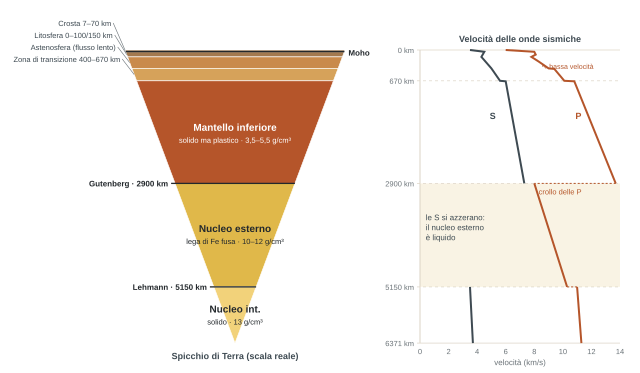

## Il Modulo 1

*I due moduli non si fanno in blocco ma in parallelo: una lezione Federico, una Piazza, per tutto l'anno.*

- **Primo semestre.** Parte generale: la tettonica delle placche e le grandi teorie unificanti della geologia. Poi il blocco rocce, insieme al Modulo 2.
- **Secondo semestre.** Dal generale al dettaglio: le rocce deformate, cioè come le rocce si modificano durante la loro storia.
- **Chiusura.** Un quadro d'unione che rimette insieme la grande e la piccola scala.
- È un corso introduttivo, alcuni argomenti vengono solo "infarinati". Si riprendono e approfondiscono in **Geologia 2** l'anno prossimo, sempre con lei: non per pigrizia, ma perché oggi mancano concetti (di fisica, di meteorologia) che servono per andare a fondo.
- La classe ha preparazioni molto varie (circa metà ha fatto Scienze della Terra alle superiori). Chiede di essere interrotta in tutti e due i sensi: "queste cose le sappiamo" oppure "non ho capito niente", per non lasciare buchi e non perdere tempo.

## La Terra in numeri

*Non da imparare a memoria. Tre dati però contano.*

| Grandezza | Valore | Perché conta |
| --- | --- | --- |
| Raggio equatoriale / polare | 6371 / 6357 km | La Terra non è una sfera: schiacciamento polare 0,0034 |
| Densità media | 5,45 g/cm³ | Le rocce di superficie stanno a 2,2–2,5: in profondità la densità deve salire molto |
| Oceani / terre emerse | 3,61 / 1,49 × 10⁸ km² | Gli oceani coprono più del doppio delle terre: il "pianeta blu", con ricadute che si vedranno |
| Massa · volume | 6 × 10²⁷ g · 1,083 × 10²⁷ cm³ | Da qui la densità media |
| Altitudine media terre · profondità media oceani | 840 m · 3900 m |  |

:::definizione
**Geoide**: superficie equipotenziale del campo gravitazionale terrestre, coincidente con il pelo libero delle acque se mari e oceani potessero passare attraverso le terre emerse. È in ogni punto perpendicolare alla direzione della forza di gravità, e definisce la forma della Terra.
:::

## Origine e composizione

### La Terra nel sistema solare

Dopo il Big Bang, circa 13,8 miliardi di anni fa **\[ndr: in aula si è sentito "15 miliardi", il valore accettato oggi è 13,8\]**, l'universo ha cominciato a espandersi e raffreddarsi, formando nebulose di gas e polveri. Per attrazione gravitazionale le particelle si aggregano, l'aggregazione produce calore e il calore innesca la fusione nucleare che accende le stelle. Il Sole ha circa 4,6 miliardi di anni **\[ndr: in aula "circa 5"\]**. Nelle parti esterne della nebulosa urti ripetuti tra particelle via via più grandi hanno dato origine ai pianeti.

**Pianeti interni** (Mercurio, Venere, Terra, Marte): piccoli, fatti di rocce e metalli, poco gas. Il motivo è il **vento solare**, il flusso di particelle cariche emesso dal Sole, che ha spazzato via gli elementi leggeri (idrogeno, elio, vapore acqueo) verso l'esterno, dove si sono accumulati nei **giganti gassosi** (con nuclei rocciosi). Nonostante questo la Terra ha un'atmosfera: come si sia formata si vedrà.

### Di cosa è fatta

Il **99%** del pianeta è fatto da soli **8 elementi**, il **90%** da quattro: ferro (35%), ossigeno (30%), silicio (15%), magnesio (13%); poi nichel 2,4%, zolfo 1,9%, calcio 1,1%, alluminio 1,1%, altri <1%. La varietà di minerali e rocce che vediamo nasce dal fatto che pochi elementi si combinano in moltissimi modi diversi (lo si vedrà a Mineralogia).

### La differenziazione

Frammenti rigidi che si urtano e restano attaccati darebbero una "mora" disordinata, non una struttura a gusci. Per riorganizzarsi la materia deve potersi muovere, quindi la proto-Terra deve aver attraversato uno o più episodi di **fusione molto estesa** (non sappiamo se totale o parziale, ma abbastanza da far migrare gli elementi). Due fonti di energia: gli **urti** tra corpi celesti e il **decadimento degli elementi radioattivi**, nuclei instabili che si trasformano in un elemento figlio (es. uranio → piombo) liberando energia e calore.

:::definizione
**Differenziazione gravitativa**: processo per cui, in una Terra parzialmente fusa, gli elementi più pesanti sono sprofondati verso il centro e quelli più leggeri sono risaliti, generando orizzonti concentrici discreti con composizione e densità diverse. La Terra è così un **pianeta differenziato**. Tra gli 8 elementi abbondanti il più pesante è il ferro: per questo si presume che il nucleo sia fatto soprattutto di leghe ferrose.
:::

Attenzione al lessico: "strato" va riservato alle rocce sedimentarie. Qui si parla di **gusci** o **orizzonti concentrici**.

## La struttura interna

*Dal centro verso fuori, cosa sappiamo. Più si scende, più le conoscenze sono indirette.*

:::definizione
**Discontinuità**: superficie attraversando la quale un parametro fa un salto brusco, qui la densità (legata alla composizione). Le discontinuità interne sono all'incirca sferiche, concentriche, e ricalcano la forma del geoide. Una **zona di transizione** invece è un intervallo in cui il cambiamento è distribuito, non istantaneo.
:::

| Guscio | Profondità | Stato · densità | Composizione |
| --- | --- | --- | --- |
| Crosta | oceanica 7–10 km · continentale 25–70 km | solida · ~2,2–3 | Si, O, Fe, Mg + elementi leggeri Al, Ca, Na, K |
| Mantello superiore | fino a 400 km | solido ma plastico · 3,5–5,5 g/cm³ | Rocce di Mg, Fe, Si, O. Il guscio più voluminoso e più eterogeneo |
| Zona di transizione | 400–670 km | solido ma plastico · 3,5–5,5 g/cm³ | Rocce di Mg, Fe, Si, O. Il guscio più voluminoso e più eterogeneo |
| Mantello inferiore | 670–2900 km | solido ma plastico · 3,5–5,5 g/cm³ | Rocce di Mg, Fe, Si, O. Il guscio più voluminoso e più eterogeneo |
| Nucleo esterno | 2900–5150 km | fuso · 10–12 g/cm³ | Lega di Fe con O, Ni, Si, S in misura minore |
| Nucleo interno | 5150–6371 km | solido · ~13 g/cm³ | Lega di Fe con O, Ni, Si, S in misura minore |

Le discontinuità portano il nome di sismologi: **Mohorovičić** (croato, "Moho" per gli amici) tra crosta e mantello; **Gutenberg** (tedesco emigrato in America, non quello della stampa) tra mantello e nucleo a ~2900 km; **Lehmann** (Inge Lehmann, sismologa) tra nucleo esterno e interno a ~5150 km.

:::esame{etichetta="Da fissare bene"}
**Il mantello non è fuso.** La crosta non galleggia su un mare di magma, per quanto lo mostrino libri e video. Il mantello è **solido ma plastico**, come una plastilina scaldata: solido, ma capace di deformarsi. Il magma dei vulcani viene da **fusioni locali e parziali** del mantello: alcuni minerali fondono e altri no, il fuso si accumula in una **camera magmatica** che a intervalli alimenta i condotti vulcanici. Gli antichi pensavano al mare di magma perché vedevano uscire lava: era intuitivo, ma sbagliato.
:::

### Crosta oceanica e crosta continentale

La crosta è la buccia della cipolla: solo lo 0,2–0,6% del raggio terrestre. Quella **continentale** è più spessa (25–70 km) e più ricca di elementi leggeri (Al, Ca, Na, K), quindi meno densa. Quella **oceanica** è sottile (7–10 km) e più ricca di Fe e Mg, quindi più densa. Sono proprio rocce diverse.

Non confondere i nomi con la presenza d'acqua. Ciò che fa "oceanica" una crosta è la **composizione**: l'acqua ci sta sopra perché quella crosta è più bassa, non il contrario. Il Mediterraneo è pieno d'acqua ma solo in parte ha sotto crosta oceanica; e i continenti non finiscono esattamente alla linea di costa (margine passivo, si vedrà).

## Come facciamo a saperlo

*Nessuno è mai sceso lì. Da scienziati bisogna chiedersi: come fa a dirmi che il nucleo è fatto così?*

L'osservazione diretta arriva poco lontano: il pozzo più profondo mai perforato raggiunge circa 14 km (dato della slide). La crosta oceanica è conosciuta per intero da campioni diretti, fino alla Moho; quella continentale no, è troppo spessa. Tutto il resto viene da **informazioni indirette**: gravità, magnetismo, ma soprattutto onde sismiche.

#### 1 · La densità (XVIII–XIX secolo)

d = m/V. Il volume lo sapevano già i Greci: Eratostene calcolò la circonferenza terrestre nel II secolo a.C. con un errore sorprendentemente basso. La massa fu calcolata alla fine del XVIII secolo. Risultato: 5,45 g/cm³ contro i 2,2–2,5 delle rocce di superficie. Quindi la densità aumenta in profondità, ma non si sapeva se in modo graduale o a salti.

#### 2 · La forma: l'uovo sodo

Se la densità crescesse gradualmente, facendo l'integrale la maggior parte della massa starebbe lontana dal centro (il centro sarebbe densissimo ma minuscolo), e la forza centrifuga della rotazione schiaccerebbe la Terra come una frittella. Non succede: quindi deve esserci un **centro molto denso** che concentra la massa attorno all'asse e stabilizza il pianeta. Già all'inizio del XIX secolo si immaginava la Terra come un uovo, con aumenti di densità a gradini.

#### 3 · Le onde sismiche: la rivoluzione

Con i sismografi (il rotolo di carta e il pennino) si possono registrare le onde prodotte dai terremoti. Si generano all'**ipocentro**, in profondità (l'**epicentro** è la sua proiezione in superficie), e si propagano come cerchi in uno stagno. Quando attraversano una brusca variazione delle proprietà fisiche cambiano **velocità** (soprattutto in funzione della densità: più densità, più velocità) e cambiano **traiettoria**. I grandi terremoti si registrano fino agli antipodi; servono però molte stazioni ben distribuite, perché non si sa dove avverrà il prossimo. Mettendo insieme i dati si è visto dove le onde "saltano": lì stanno le discontinuità.

Perché cambia la traiettoria? Su una superficie tra due mezzi di densità o stato fisico diverso (solido/liquido) il raggio incidente si sdoppia: un **raggio riflesso** torna indietro con lo stesso angolo, un **raggio rifratto** prosegue nel secondo mezzo cambiando angolo. È il bastone nell'acqua che sembra spezzato. Vale per tutte le onde: lo si ritroverà a Mineralogia con la luce.

#### 4 · Le meteoriti

Le meteoriti sono **silicatiche** (minerali basati sul gruppo SiO, simili alle rocce terrestri), **ferrose** (leghe di ferro) o **miste**. La densità media di tutte quelle analizzate è molto vicina alla densità media terrestre: più di una coincidenza. Se tutto il sistema solare viene dalla stessa nebulosa, le meteoriti hanno una "madre comune" con la Terra. Per esclusione: se le silicatiche somigliano alla crosta, le ferrose somigliano a ciò che non vediamo. E la loro densità è compatibile con quella calcolata per il nucleo.

:::nota{etichetta="Nota di metodo"}
Sulla composizione del nucleo è un "forse": indizi convergenti, non prove. Come un detective che mette insieme più indizi: la conclusione è probabile, non certa.
:::

## Litosfera e astenosfera

*Un'altra suddivisione, solo per i gusci più superficiali, che non dipende dalla densità ma dalla reologia.*

:::definizione
**Reologia**: il comportamento di un materiale quando si tenta di deformarlo. **Viscosità**: resistenza a fluire; più è alta, meno il materiale fluisce. Dipende dalla temperatura.

**Litosfera**: crosta + parte alta del mantello superiore (**mantello litosferico**, stessa composizione di quello sotto). Relativamente rigida e priva di flusso, primi 100–150 km. **Astenosfera** (dal greco *asthenés*, debole): parte del mantello superiore relativamente debole e capace di **flusso lento**, come plastilina scaldata o miele.

Il confine coincide grosso modo con l'**isoterma dei ~1280 °C**: è una questione di temperatura e viscosità, non di composizione.
:::

Il limite inferiore dell'astenosfera è sfumato e poco noto (c'è chi lo fa coincidere con la zona di transizione), anche perché dentro ci sono moti convettivi che probabilmente lo muovono. Interessa poco. Il limite **superiore** invece conta moltissimo: la litosfera è spezzettata in **placche** che possono muoversi proprio perché sotto c'è l'astenosfera. Se tutto fosse rigido la Terra sarebbe un pianeta morto: niente vulcani, niente terremoti.

Non solo movimenti orizzontali: anche quelli **verticali**. La Moho è ondulata (sprofonda sotto l'Himalaya, risale sotto gli oceani) e il limite inferiore della litosfera la ricalca, quindi la litosfera continentale è molto più spessa di quella oceanica. La litosfera "galleggia" sull'astenosfera, ma non perché questa sia fusa: come un biscotto appoggiato sul miele.

### L'isostasia col sughero e la quercia

Il modellino del Marshak: due blocchi di quercia (il mantello litosferico, stessa composizione) di spessore diverso, uno coperto da uno spesso strato di **sughero** (crosta continentale, leggera), l'altro da un sottile strato di **pino** (crosta oceanica, più densa), messi in acqua. Il primo galleggia più in alto. È il **principio di Archimede**: un corpo immerso riceve una spinta verso l'alto pari al peso del fluido spostato. Più spessa e più leggera, la litosfera continentale sposta più fluido e riceve più spinta: per questo i continenti stanno sopra il livello del mare.

Ne segue che se la crosta cambia spessore, l'astenosfera reagisce e la spinge su o la fa affondare. Le Alpi si stanno ancora sollevando: chi le spinge? La spinta di galleggiamento dal basso, come un pallone tenuto sott'acqua che appena lo molli schizza fuori.

:::nota{etichetta="Modelli analogici"}
Modello analogico = fatto con materiali (sabbia, plastilina, acqua), non digitale. I materiali sono **scalati** rispetto alle proprietà da rappresentare (qui la differenza di viscosità acqua/legno riproduce quella astenosfera/litosfera), in modo che il processo avvenga in tempi umani e non in milioni di anni.
:::

## Temperatura, calore, pressione

### Temperatura

Curve stimate in kelvin (K = °C + 273,15). La Terra è solida dove la temperatura è inferiore alla temperatura di fusione (per una roccia è un intervallo, non un punto, perché ogni minerale fonde a una temperatura diversa). L'**unico punto** in cui la temperatura supera quella di fusione è il **nucleo esterno**. Nel nucleo interno, stesso materiale, torna solido: la temperatura di fusione **cresce con la pressione**, e a quella profondità la supera di nuovo. Al passaggio mantello–nucleo si è sopra i 4200 K.

### Da dove viene il calore

Il flusso termico misurato in superficie è maggiore del calore che arriva dal Sole: deve venire dall'interno. Altre prove: i prodotti dei vulcani, e le miniere più profonde (circa 3 km) dove si arriva a 50–60 °C. Due origini:

- **Calore iniziale**, immagazzinato quando la proto-Terra era fusa; il raffreddamento è partito dall'esterno. È un budget finito: la Terra tende a raffreddarsi lentamente.
- **Decadimento radioattivo** di isotopi instabili (uranio, torio, potassio) presenti in crosta e mantello.

Col raffreddamento la litosfera potrebbe ispessirsi sempre di più fino a bloccare tutto, come è già successo a pianeti più piccoli del sistema solare. Prospettiva lontanissima: la tettonica delle placche ce la dobbiamo studiare comunque.

### Pressione

Aumenta con la profondità in modo non lineare, con un flesso proprio al passaggio mantello–nucleo. Si misura in **gigapascal**: il pascal (1 N/m²) è piccolissimo per la geologia, si usano multipli. Al limite mantello–nucleo circa 140 GPa, cioè circa 1.380.000 volte la pressione atmosferica. Al centro circa 360 GPa.

## Le onde sismiche P e S

- **Onde P**: le prime registrate, le più veloci. **Onde S**: le seconde, più lente, sono **onde di taglio** e **non si propagano nei liquidi**. Questo è il punto chiave per capire se sotto di noi ci sono zone liquide.
- **Crosta e mantello litosferico**: velocità in aumento continuo.
- **Zona di bassa velocità**, nel mantello superiore, sotto la litosfera: le onde rallentano. Interpretazione: un 2–3% di goccioline di fuso diffuse. Non è la zona di transizione, è più superficiale e più sottile.
- **Mantello superiore**: la velocità riprende a salire, oltre 8 km/s.
- **Zona di transizione** (400–670 km): nessun salto netto ma una serie di gradini e irregolarità, forse composizionali. Non si sa.
- **Mantello inferiore**: aumento regolare.
- **Gutenberg**: le P crollano (il nucleo esterno è liquido, mezzo diverso) e poi risalgono fino a Lehmann, dove fanno un altro salto. Le S **si azzerano**: è la prova principale che il nucleo esterno è liquido (zona d'ombra delle S).

## Il campo magnetico terrestre

Somiglia al campo di un **dipolo**, come una barretta magnetica su limatura di ferro. I poli magnetici non coincidono esattamente con quelli geografici, e le linee di forza sono distorte: schiacciate dal lato rivolto al Sole, allungate dal lato opposto. Il vento solare è fatto di particelle cariche in movimento, che generano un campo magnetico proprio in conflitto con quello terrestre. L'involucro del campo si chiama **magnetosfera**.

Il campo devia le particelle cariche del Sole e protegge la superficie da un bombardamento che probabilmente non avrebbe permesso la vita. E si genera, presumibilmente, da **moti convettivi nel nucleo esterno**: una lega di ferro fusa in movimento produce un campo magnetico. Se il nucleo esterno fosse solido, niente movimento, niente campo. In sintesi: **siamo qui perché il nucleo esterno è liquido**. Un oggetto a 2900 km di profondità ha ricadute dirette sulla vita.

Il campo si **inverte** periodicamente, e lo sappiamo dalle rocce. Durante un'inversione l'intensità cala molto (per invertirlo va quasi azzerato): è lo spunto dei film catastrofici, ma al di là dell'allarmismo il ruolo del campo resta fondamentale.

## Il "Sistema Terra"

Quattro sfere che interagiscono di continuo, con confini sfumati (la distinzione è una semplificazione). **Idrosfera**: acque superficiali e sotterranee; gli oceani coprono circa il 71% del pianeta e contengono il 97% dell'acqua. **Atmosfera**: involucro gassoso fino a circa 100 km, protegge dalle radiazioni solari. **Biosfera**: tutta la vita, che si adatta all'ambiente ma lo influenza anche. **Geosfera**: la Terra solida, la parte più voluminosa; anche la sua parte profonda e inaccessibile influenza le altre, come mostra il campo magnetico. Due fonti di energia muovono tutto: la **radiazione solare** e il **calore interno**.

## Da fare

- [ ] Fare l'esercizio "Label the layers of the Earth" (ultima slide): è del tipo che può capitare nella parte pratica d'esame. Correzione in aula la prossima lezione.
- [ ] Ridisegnare a mano lo spicchio di Terra con gusci, profondità e le tre discontinuità, e accanto il profilo delle onde P e S.
- [ ] Scrivere con parole proprie: geoide, differenziazione gravitativa, discontinuità, litosfera, astenosfera, reologia, viscosità.
- [ ] Ripetersi finché diventa automatico: il mantello è solido ma plastico, non fuso.
- [ ] Video della lezione: riassunto sulla struttura interna, youtu.be/CoOr8YOYIiI · confronto tra fluidi a viscosità diversa, youtu.be/FwzfUeZ7xmw.
- [ ] Cercare il Marshak usato o in biblioteca.
