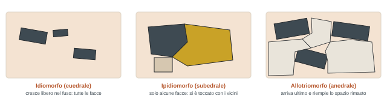
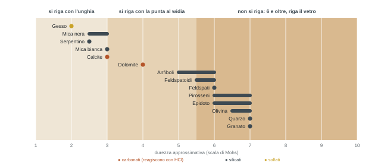

## Perché i minerali, e quali

*Non è mineralogia (quella parte a novembre, con la sistematica nel secondo semestre). Qui i minerali servono solo come costituenti delle rocce: riconoscerli per riconoscere, classificare e collocare la roccia.*

Le rocce sono fatte di cristalli di minerali, di frammenti di cristalli e, per le sedimentarie, di componenti che vengono dalla biosfera (i fossili), che però si conservano quasi sempre come parti mineralizzate. Il docente l'ha annunciata come la lezione "noiosa": dalla prossima si comincia con le rocce magmatiche.

:::definizione
**Minerale**: sostanza solida cristallina naturale, generalmente inorganica, con una specifica composizione chimica.

*Solida*, niente gas o liquidi. *Naturale*, esclusi i prodotti di sintesi (i diamanti artificiali). *Cristallina*, cioè con un **reticolo cristallino**: atomi o ioni disposti secondo un modello geometrico ordinato e periodico, caratteristico di ogni minerale. *Generalmente inorganica*. *Composizione chimica specifica*, esprimibile con una formula precisa (anche lunghissima).

Tutti i minerali sono solidi, ma non tutti i solidi sono minerali: quelli senza struttura ordinata e periodica sono **vetrosi** o **amorfi** (al massimo un ordine locale e disordinato).
:::

### Come crescono i cristalli

Un cristallo nasce da un nucleo microscopico e cresce secondo superfici piane naturali, le **facce**, dettate dal reticolo. Lasciato libero cresce uguale a se stesso e ha la forma che il reticolo prevede. Quando incontra vincoli (altri cristalli, poco spazio, cristallizzazione troppo rapida) la crescita si ferma del tutto o in parte e la forma si deforma. Spesso i cristalli si uniscono in aggregati detti **granuli**, in cui solo pochi individui hanno facce ben sviluppate.

:::nota{etichetta="Aspettative realistiche"}
Nelle rocce non si trovano i bei cristalli da collezione. Si trovano minerali comuni, spesso piccoli e malformati. E anche una bella vena mineralizzata, di solito, non dice nulla sulla roccia.
:::

### I minerali da conoscere

Ne esistono moltissimi, ma per il riconoscimento sistematico delle rocce ne bastano una **trentina**. In ordine di importanza per gruppo:

| Gruppo | Gruppo chimico | Quelli che useremo |
| --- | --- | --- |
| Silicati | \[SiO₄\]⁴⁻ con altri elementi. I più abbondanti | quarzo, feldspati alcalini, plagioclasi, feldspatoidi, olivina, anfiboli, pirosseni, granati, epidoto, e i fillosilicati mica bianca, mica nera, serpentino, clorite |
| Carbonati | \[CO₃\]²⁻ con Ca e/o Mg | calcite, dolomite. Fondamentali nel processo sedimentario |
| Solfati | \[SO₄\]²⁻, qui con il calcio | anidrite e gesso: due modi di presentarsi del solfato di calcio, anidro e idrato |
| Ossidi | O + elemento metallico | magnetite, spinello, ematite, rutilo. Solo accessori, non li cercheremo |
| Solfuri | S²⁻ + elementi metallici | pirite. Solo accessorio |

I pirosseni non si distinguono in orto- e clino- a livello macroscopico: si dice "pirosseno" e basta (la distinzione arriva a Mineralogia).

## Le sette proprietà da osservare

*Si valutano a occhio nudo o con la lente 10×, con la punta al widia e con l'acido cloridrico al 10%. Durezza vera, peso specifico e proprietà magnetiche, ottiche ed elettriche richiedono strumenti: sono cose da Mineralogia.*

### 1 · Abito e tessitura

Come si presenta esternamente il cristallo, in base a quanto si sono potute sviluppare le facce.

- **Euedrale (idiomorfo)**: completamente delimitato da facce cristalline, crescita non disturbata. Ha il suo abito proprio.
- **Subedrale (ipidiomorfo)**: facce solo in parte, crescita parzialmente limitata dai vicini.
- **Anedrale (allotriomorfo)**: nessuna faccia, crescita completamente limitata. Non ha il suo abito.

Alcuni minerali sono tipicamente allotriomorfi (il quarzo, i plagioclasi), altri tendono a essere idiomorfi: dipende dall'ordine di cristallizzazione.

**Tessitura**, cioè come sono disposti i cristalli: *radiale* (a raggiera da un punto), *a feltro* (intrecciati), *foliata* (sovrapposti come i fogli di un quaderno), *granulare* (cristallo contro cristallo a riempire tutto il volume).

**Habitus**, la forma del singolo cristallo, lungo due assi: allungandosi si va da equidimensionale ad allungato-colonnare, aciculare, fibroso; appiattendosi da colonnare tozzo a tabulare, planare, micaceo; incrociando le due tendenze, laminare.

:::nota{etichetta="Attenzione"}
Sulla superficie di rottura della roccia il minerale si vede quasi sempre in **due dimensioni**. Un tabulare può sembrare un rettangolo, un globulare un poligono. Bisogna girare il campione e ricostruire mentalmente la terza dimensione.
:::

### 2 · Lucentezza

La capacità di riflettere la luce. **Metallica**, tipica di solfuri e ossidi (il cubetto di pirite). **Non metallica**, dei minerali trasparenti o traslucidi, che a sua volta può essere adamantina (diamante), **vitrea** (quarzo), **sericea** (come la seta, cangiante: serpentino), grassa (talco), **madreperlacea** (miche), resinosa (zolfo), terrosa (molto spenta). Le tre da tenere a mente sono vitrea, sericea e madreperlacea: aiutano a riconoscere quarzo, serpentino e miche.

### 3 · Trasparenza

**Opaco**: non si fa attraversare dalla luce. **Trasparente**: si vede cosa c'è dietro, come nel vetro. **Traslucido**: la luce passa, ma dietro si distingue a fatica.

### 4 · Colore

Si valuta in luce naturale. Un minerale è **incolore** se non assorbe (o assorbe poco e in modo uguale) le lunghezze d'onda della luce; è colorato se ne assorbe alcune in modo selettivo. Le cause sono distorsioni del reticolo o ioni cromofori che occupano siti di altri elementi. **Idiocromatici**: sempre lo stesso colore. **Allocromatici**: colori diversi o incolori. Per questo il colore da solo raramente basta.

:::esame{etichetta="Errore classico"}
**Incolore non vuol dire bianco.** Il bianco è un colore. Incolore implica trasparenza: si vede quello che c'è sotto, come nel vetro di una finestra. È l'errore che fanno tutti all'inizio.
:::

### 5 · Durezza approssimativa

La resistenza a essere scalfito. In Mineralogia si usa la scala di Mohs con le sue punte di durezza nota. Qui, speditivamente, bastano l'**unghia** e la **punta al widia**: si riga o non si riga.

### 6 · Sfaldatura e frattura

Come reagisce il minerale a una sollecitazione. Con la punta lo si "stuzzica", oppure si guarda la superficie lasciata quando si è staccato il campione.

- **Sfaldatura**: rottura lungo superfici piane parallele a piani cristallografici, dove i legami sono più deboli. Il pezzo che si stacca è confrontabile con quello di partenza: si ripropone la struttura del cristallo. Può essere netta, incerta o assente, in una o più direzioni.
- **Frattura**: risposta disorganizzata, nei minerali con legami uguali in tutte le direzioni. Il pezzo che si ottiene non è una copia del cristallo. **Concoide**: come il segno di una cucchiaiata nel budino, indica un materiale molto omogeneo. **Scheggiosa** o fibrosa, produce schegge. **Irregolare**: superficie tormentata, come quella di una martellata su un mattone.

### 7 · Reattività all'acido cloridrico

Una goccia di HCl al 10% sul minerale. I carbonati si sciolgono e liberano CO₂, che si vede come bollicine che "friggono":

**CaCO₃ + 2HCl → CaCl₂ + H₂O + CO₂**

- **Calcite**: reagisce vivacemente anche **a freddo**. È il minerale per eccellenza reattivo all'acido: un bel cristallo di calcite sotto la goccia sparisce.
- **Dolomite** e gli altri carbonati: reagiscono solo **a caldo**. Si scalda il campione con un accendino e poi si mette la goccia.
- Una debole reazione in una roccia che non è un carbonato può dipendere da un po' di calcite dispersa.
- All'inizio si mette l'acido anche sul quarzo, che è inerte, giusto per prendere la mano. Poi lo si usa solo quando ha senso, come verifica ulteriore.

:::nota{etichetta="Sicurezza"}
Solo acido al 10%. In commercio si trova anche al 30%: sulle mani e sugli occhi diventa pericoloso. Non comprare mai niente di più concentrato.
:::

## Le schede dei minerali

*Da stampare o tenere sul tablet e portare alle esercitazioni e all'esame. Non vanno imparate a memoria: sono il prontuario per confrontare quello che si osserva.*

### Silicati: i chiari

::campioni{id="quarzo,ortoclasio,plagioclasio"}

#### Quarzo

Il minerale "infestante": si trova dappertutto, in rocce sedimentarie, magmatiche e metamorfiche. È estremamente stabile, passa da una roccia all'altra mantenendo inalterate le sue caratteristiche, e per molte classificazioni è il primo elemento che si va a guardare. Di solito **allotriomorfo**, perché cristallizza per ultimo e occupa lo spazio che resta; quando cresce in pace è un prisma allungato. Lucentezza **vitrea**: sembra un coccio di bottiglia, vetro rotto. Da trasparente a traslucido, **incolore** per definizione; a volte violaceo, rosato, giallino (ametista, citrino, pietre semipreziose, ma nelle rocce è raro). Durezza **7**: riga l'acciaio del martello. Nessuna sfaldatura: frattura concoide secondo i testi, ma spesso molto irregolare. Inerte all'HCl.

#### Feldspato alcalino

Prismatico tabulare, spesso **idiomorfo**. Lucentezza perlacea. Da opaco a trasparente: quando è pulitissimo sembra quasi trasparente, e lì si può confondere. Colore dal bianco latte al rosa, marrone chiaro, rosso. Durezza circa 6. Sfaldatura netta secondo piani paralleli, e molto spesso una **geminazione** ben visibile: durante la crescita le facce formano un piccolo angolo, e ruotando il campione la luce si riflette prima su una metà e poi sull'altra, come se fossero due cristalli saldati. Inerte all'HCl. Frequente in rocce magmatiche e metamorfiche, più raro nelle sedimentarie perché **labile**: si altera facilmente e viene distrutto lungo la storia della roccia, l'opposto del quarzo.

#### Plagioclasi

Parenti stretti dei feldspati alcalini. Abito prismatico tabulare, sul campione appaiono come rettangoli. Quasi sempre **allotriomorfi**: riempiono lo spazio lasciato dagli altri; raramente idiomorfi. Traslucidi, più raramente trasparenti. "Lucentezza bianca", colore dal bianco latte al bianco farina, a volte debolmente colorati, e con l'alterazione anche toni verdi. Durezza 6. Sono sempre geminati, ma la geminazione a occhio nudo non si vede. Sfaldano lungo piani perpendicolari. Inerti all'HCl. Magmatici e metamorfici, rari nelle sedimentarie: labili anche loro.

#### Feldspatoidi

Meno frequenti. Abito globulare o prismatico tozzo: poliedri a molte faccette che tendono alla sfera. Traslucidi, da vitrei a opachi o madreperlacei, dal bianco al grigiastro (incolori solo se purissimi). Durezza 5,5–6. Potenzialmente sfaldabili, ma sollecitati di solito si rompono e basta. Inerti all'HCl. Tra i minerali bianchi si riconoscono proprio perché **globulari**. Tipici delle rocce magmatiche; labili, quasi assenti nelle sedimentarie.

### Silicati: i colorati

::campioni{id="olivina,augite,orneblenda"}

#### Olivina

Quella che si vede nei gioielli come peridoto. Nelle rocce spesso è un aggregato, ma la forma classica è **globulare** e tende all'idiomorfo. Vitrea come il quarzo, sembra anche lei un fondo di bottiglia, tendenzialmente trasparente ma **mai incolore**: verde scuro, **verde oliva**, giallastro. Da qui il nome, e da qui la distinzione facile dal quarzo. Durezza 6,5–7. Ha quasi sempre un aspetto fratturato, mentre il quarzo sembra più integro. Inerte all'HCl. È instabile fuori dalle condizioni del magma e si trasforma facilmente in altri minerali: trovarla fresca e sana è piuttosto raro.

#### Anfiboli

Grande gruppo, si somigliano tutti. Prismatici molto allungati, fino ad aciculari, spesso in aggregati **a ciuffi radiali** che partono da un punto. Piccoli: si guardano con la lente. Vitrei, da opachi a traslucidi, colore dal **nero al verde al blu scuro**. Durezza 5–6: delicati, con la punta tendono a rompersi. Si sfaldano perfettamente in prismi uguali a quello di partenza, ma essendo piccoli non è facile vederlo. Il riconoscimento passa soprattutto per questo abito stretto, allungato, a ciuffi. Inerti all'HCl. Magmatici e metamorfici.

#### Pirosseni

Parenti degli anfiboli. Spesso **idiomorfi**, prismatici ma **tozzi**, non aciculari: questo li distingue dagli anfiboli. Opachi, sempre colorati: nero, bruno, verde, a volte verde smeraldo molto brillante. Durezza 6–7. Teoricamente sfaldabili in forme prismatiche, se sani; altrimenti si rompono. Inerti all'HCl. Magmatici e metamorfici, accessori nel sedimentario. **\[ndr\]** La slide indica lucentezza "metallica": di norma i pirosseni hanno lucentezza vitrea, al massimo submetallica in alcune varietà; nell'audio il passaggio non è chiaro (?).

#### Granati

**Globulari**, equidimensionali, poliedri che tendono alla sfera, spesso idiomorfi. Da vitrei a resinosi, da traslucidi a opachi. Colori molto variabili: rossastri, verdastri, bruni, comunque ben colorati. Molto duri (7): si usano come pietre dure. Nessuna sfaldatura evidente, frattura concoide. Inerti all'HCl. Magmatici e metamorfici; nel sedimentario solo come frammenti, mai con genesi sedimentaria.

#### Epidoto

Uno dei più difficili da riconoscere. Piccoli prismetti a volte allungati, sempre piccoli: si vedono bene solo con la lente, come puntini verdastri. Raramente trasparenti, più spesso opachi e colorati: verde, verde-giallastro, verde-brunastro, giallo, grigio, nero. Il colore dipende dalla chimica e quindi dalla giacitura (lo si vedrà nel secondo semestre). Durezza 6–7, la punta non lo riga. Sfaldatura netta secondo l'allungamento, ma su cristalli così piccoli a occhio nudo è quasi impossibile vederla. Inerte all'HCl. Magmatico e metamorfico, nel sedimentario solo come frammenti.

### Silicati: i fillosilicati

::campioni{id="biotite,muscovite"}

#### Mica bianca e mica nera

Gruppi informali: dentro ci sono molte specie con nomi e composizioni propri (per la mica bianca tipicamente la muscovite, per la nera la biotite). Il tratto che le fa riconoscere al volo: sono prismetti fatti da **innumerevoli lamelle sovrapposte**, con legami debolissimi tra un foglio e l'altro. Basta l'unghia o la punta per far saltare una lamella: si sfogliano come un blocchetto, e finiscono sulle mani quando ci si lavora. Durezza circa 3 (bianca) e 2,5–3 (nera). Lucentezza madreperlacea, a tratti quasi metallica. **Mica bianca**: mai davvero bianca, argentea fino al giallastro quasi dorato, da trasparente a traslucida. **Mica nera**: da nera a marrone scuro a verde scuro, da opaca a traslucida. Dimensioni da pochi millimetri a qualche centimetro: conta che si sfogli, non quanto è grande. Inerti all'HCl. Magmatiche e metamorfiche, legate alla cristallizzazione; abbondanti come detrito nelle sedimentarie.

La foto del granito in slide li mette insieme: il vitreo trasparente è il quarzo, i bianchi sono feldspati (alcalini se idiomorfi e geminati, plagioclasi se allotriomorfi e a riempire gli spazi, come qui), i neri a lamelle sono mica nera.

#### Serpentino

Fillosilicato anche lui, ma le lamelle sono **arrotolate** su se stesse: niente effetto blocchetto, ma un abito **fibroso**, a aghetti radiali o a feltro. Lucentezza **sericea**, colori cangianti dal bianco al verde al giallastro. Opaco. Si fanno saltare via fibra per fibra. Durezza bassa (2,5): si lavora con l'unghia. Inerte all'HCl. Deriva in larga parte dall'**alterazione dell'olivina** nel processo metamorfico, e compare come detrito, a volte abbondante, nelle sedimentarie. In questo gruppo ci sono le specie fibrose dell'**amianto**, con le malattie legate alle fibre come l'asbestosi.

#### Clorite

Simile alle miche: fogliata, lamelle sovrapposte che si staccano. Normalmente **verde**, opaca, tra lucida e vitrea. Durezza di difficile valutazione, molto variabile. Inerte all'HCl.

### Carbonati

::campioni{id="calcite,dolomite"}

#### Calcite

La più famosa e frequente. Spesso idiomorfa, tabulare o prismatica, ma molto spesso in aggregati granulari. Da traslucida a trasparente, lucentezza da vitrea a polverosa. Incolore se trasparente, poi bianca, fino al rosa. Tenera, durezza 3: la punta al widia la riga subito. Sfalda secondo le facce del romboedro. **Reazione vivacissima all'HCl a freddo**. Frequentissima nel processo sedimentario, presente in quello metamorfico; i carbonati magmatici sono rarissimi e legati a condizioni particolari.

#### Dolomite

Parente stretta della calcite: al calcio si associa e in parte si sostituisce il magnesio. Idiomorfa, da equidimensionale a tabulare, spesso granulare. Da vitrea a madreperlacea, da trasparente a traslucida (raramente lucida). Bianca, bianco-rosata, più raramente giallastra. Un po' più dura della calcite (4). Sfalda secondo il romboedro. Reagisce all'HCl **solo a caldo**: si scalda il campione, poi la goccia.

### Solfati (solo slide)

::campioni{id="gesso"}

#### Anidrite

Solfato di calcio anidro. Spesso idiomorfa, prismatica fibrosa o granulare. Lucentezza vitrea, perlacea, grassa o madreperlacea; da trasparente a traslucida; grigia, bianca o azzurra. Durezza 3. Sfalda secondo coppie di facce parallele.

#### Gesso

Solfato di calcio idrato. Spesso idiomorfo, da tabulare a fibroso, granulare. Da vitreo a perlaceo a sericeo, da traslucido a trasparente; bianco, grigio, giallastro, bruno. Durezza **2**: si riga con l'unghia. Sfaldabile in lame e scagliette.

:::ndr{etichetta="Reattività all'HCl"}
Le slide danno anidrite e gesso come "reattivi" all'HCl. Non fanno però l'effervescenza dei carbonati: sono solfati e non liberano CO₂. Al massimo si sciolgono lentamente. Se sul campo una goccia fa le bollicine, quello è un carbonato. Da verificare con il docente cosa intende la slide.
:::

## Il prontuario in una tabella

*Sintesi delle schede, per il confronto veloce durante le esercitazioni.*

| Minerale | Abito | Lucentezza · trasp. | Colore | D | Sfald. / frattura | HCl |
| --- | --- | --- | --- | --- | --- | --- |
| Quarzo | allotriomorfo, prisma allungato | vitrea · trasp.–trasl. | incolore (viola, rosa) | 7 | frattura concoide | no |
| Feldsp. alcalino | idiomorfo, tabulare | perlacea · opaco–trasp. | bianco latte, rosa, rosso | 6 | netta, geminazioni | no |
| Plagioclasi | idio–allotriomorfo, tabulare | "bianca" · opaco–trasp. | bianco latte–crema | 6 | piani perpendicolari | no |
| Feldspatoidi | globulare, tozzo | vitrea–madrep. · trasl. | incolore–grigio | 5,5–6 | difficile | no |
| Olivina | idiomorfo, globulare | vitrea · trasp.–trasl. | verde oliva, giallastro | 6,5–7 | frattura concoide | no |
| Anfiboli | allungato, aciculare, radiale | vitrea · opaco–trasl. | nero, verde, blu scuro | 5–6 | in prismi | no |
| Pirosseni | idiomorfo, tozzo | vedi \[ndr\] · opaco–trasl. | nero, bruno, verde | 6–7 | in prismi | no |
| Granato | idiomorfo, globulare | vitrea–resinosa · trasl.–opaco | rosso, verde, bruno | 7 | frattura concoide | no |
| Epidoto | prismetti piccoli | vitrea · opaco–trasp. | verde, giallo, grigio, nero | 6–7 | secondo l'allungamento | no |
| Mica bianca | lamelle sovrapposte | madreperlacea · trasp.–trasl. | argentea–dorata | 3 | in lamine | no |
| Mica nera | lamelle sovrapposte | madreperlacea · opaca–trasl. | nero, marrone, verde scuro | 2,5–3 | in lamine | no |
| Serpentino | fibroso, radiale, a feltro | sericea · opaco | verde, bianco giallastro | 2,5 | in fibre | no |
| Clorite | fogliata | vitrea · trasl. | verde | var. | in lamelle | no |
| Calcite | tabulare, granulare | vitrea–polverosa · trasl.–trasp. | incolore, bianco, rosa | 3 | romboedro | **sì, a freddo** |
| Dolomite | equidim.–tabulare, granulare | vitrea–madrep. · trasp.–trasl. | bianca, rosa, giallastra | 4 | romboedro | **sì, a caldo** |
| Anidrite | fibroso, granulare | vitrea–grassa · trasp.–trasl. | grigio, bianco, azzurro | 3 | coppie di facce | vedi \[ndr\] |
| Gesso | tabulare–fibroso | vitrea–sericea · trasl.–trasp. | bianco, grigio, bruno | 2 | lame, scagliette | vedi \[ndr\] |

### Dove si trovano: labili e stabili

Un filo che torna in tutte le schede. Il **quarzo** è stabilissimo e passa indenne da una roccia all'altra, quindi è ovunque. **Feldspati, plagioclasi e feldspatoidi** sono **labili**: si alterano e spariscono durante la storia della roccia, per questo sono rari nelle sedimentarie. **Olivina** è instabile appena lasciate le condizioni del magma. **Granati ed epidoto** sono magmatici o metamorfici e nel sedimentario compaiono solo come frammenti. **Miche e serpentino** finiscono spesso come detrito nelle sedimentarie. **Carbonati e solfati** sono di casa nel sedimentario.

## Da fare

- [ ] Stampare le schede dei minerali (le slide) o averle sul tablet: servono alle esercitazioni e all'esame.
- [ ] Procurarsi al più presto **lente e punta al widia**: tra una settimana si comincia con le rocce magmatiche. L'acido lo fornisce il docente in aula; martello e resto possono aspettare.
- [ ] Ridisegnare la scala di durezza speditiva con i minerali al loro posto, e i tre schizzi idiomorfo / ipidiomorfo / allotriomorfo.
- [ ] Fissare le due trappole: incolore non è bianco; la calcite reagisce a freddo, la dolomite solo a caldo.
- [ ] Chiedere al docente (o a un compagno) il chiarimento sulla reattività di anidrite e gesso e sulla lucentezza dei pirosseni.

### Prossima lezione con Piazza

Si comincia con le rocce magmatiche.
