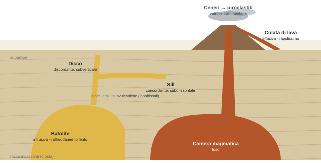
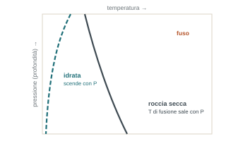
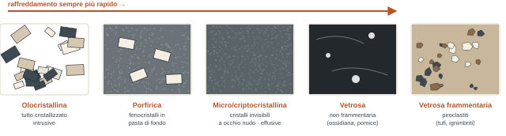
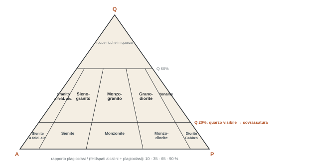

## Comunicazioni

- **Corso sicurezza da 4 ore**: gli attestati arrivati finora sono pochi. Chi l'ha fatto mandi l'attestato al prof.
- **Informativa e consenso**: questa settimana il prof manda un documento da leggere, una liberatoria privacy per foto e immagini in aula e durante le uscite. Niente di strano, ma c'è piena libertà di negare il consenso: chi lo nega lo dica.
- **Lunedì 5 e martedì 6 ottobre**: riconoscimento delle rocce magmatiche sui campioni. Servono lente e punta.

## Il processo magmatico

*Una carrellata di concetti fondamentali: solo quelli che servono per arrivare alla classificazione.*

:::definizione
Le **rocce magmatiche** (o ignee: sono sinonimi) si generano dal consolidamento, cioè dalla solidificazione, di masse di fuso. Il fuso è quasi sempre **silicatico**, rarissimamente carbonatico, più o meno ricco in una fase fluida o gassosa. I fusi silicatici prendono nel loro insieme il nome di **magma**.
:::

Il consolidamento avviene per raffreddamento, e tutto dipende da **tempi e modi di dissipazione del calore**. Tre casi:

- **Intrusive**: il magma resta dentro la crosta e raffredda lentamente. Serve per forza una **roccia incassante**, un volume di rocce che contiene il fuso e attraverso cui il calore viene dissipato piano piano.
- **Effusive** (tipicamente le vulcaniche): il fuso arriva in superficie, esce dalla crosta e si spande sulla superficie del pianeta, entrando subito in contatto con aria o acqua. Raffreddamento **rapidissimo**. Durante l'emissione una parte dei volatili si disperde nell'atmosfera, un'altra resta intrappolata nel materiale emesso.
- **Subvulcaniche** (ipoabissali): la via di mezzo. Il magma riempie fratture nelle rocce incassanti e resta intrappolato vicino alla superficie senza arrivarci. Raffreddamento relativamente lento: più veloce delle intrusive, più lento delle effusive.

:::nota{etichetta="Subvulcaniche: attenzione"}
Su un singolo campione a mano sono difficili da riconoscere. La loro identificazione è certa solo **sul terreno**, osservando i rapporti con le rocce circostanti: un volume di roccia magmatica contenuto dentro altre rocce. In aula il prof ha detto che vengono classificate e trattate insieme alle intrusive (?), anche se la tessitura può avvicinarsi a quella delle effusive. **\[ndr\]** Nella pratica si usano i nomi delle intrusive con il prefisso "micro" (microgranito, microgabbro).
:::

Sulla genesi incidono tre fattori, **temperatura, pressione e attività dei fluidi**, ma quello che condiziona di più la solidificazione è la **temperatura**. Più il raffreddamento è lento, più la roccia sarà francamente cristallina; più è veloce, più sarà vetrosa. Le intrusive vedono una piena cristallizzazione dell'intera massa, le vetrose nessuna: sono i due estremi.

### Da dove vengono i magmi

- **Fusione parziale del mantello** → magmi **basici**.
- **Fusione parziale della crosta continentale** → magmi **acidi**.

Basico e acido si riferiscono alla ricchezza in **silice**. Il chimismo del magma condiziona quali minerali si possono formare, e i minerali condizionano il tipo di roccia. Una roccia sarà quindi orientata verso il basico o verso l'acido già a partire dalla sua composizione mineralogica.

## Strutture intrusive ed effusive

*"Un po' di nomenclatura. È la vostra vita di geologi."*

:::definizione
**Plutone**: corpo di rocce magmatiche intrusive cristallizzate e segregate nella crosta terrestre. Tre tipi.

**Batolite**: corpo intrusivo di grandi dimensioni (**> 100 km²**), completamente segregato negli incassanti, in profondità.

**Dicco**: corpo intrusivo **tabulare discordante**, cioè che taglia le rocce incassanti (giacitura subverticale). **Sill**: corpo intrusivo **tabulare concordante**, parallelo agli strati (giacitura suborizzontale).
:::

Dicchi e sill sono più piccoli e meno profondi dei batoliti, e legati alla risalita del fuso verso la superficie, ma tendono comunque a restare segregati. Le effusive invece sono il prodotto della risalita completa: effusione di lava in superficie oppure dispersione di materiale **piroclastico** (frammentario), con la ricaduta delle ceneri emesse in atmosfera.

## L'acqua e i volatili

- In condizioni **secche (anidre)** la temperatura di fusione **aumenta** con la pressione.
- In condizioni **umide (idrate)** la temperatura di fusione **diminuisce** con la pressione: l'acqua agisce da **fondente**, termine preso dalla siderurgia. Abbassa il punto di fusione.

:::esame{etichetta="La domanda del prof: dov'è l'acqua in una roccia \"umida\"?"}
Non si tratta di essere bagnati o all'asciutto in superficie. L'acqua sta **nel reticolo cristallino** dei minerali idrati (ad esempio le miche, i fillosilicati, sotto forma di ossidrili). Come la tiro fuori? Con la **pressione**: aumentandola è come se spremessi il reticolo, che libera l'acqua nel sistema, e quell'acqua fa da fondente. Tornerà con la prof.ssa Federico nella dinamica crostale.
:::

### I volatili nelle eruzioni

Durante l'attività vulcanica si liberano grandi quantità di componenti volatili in forma gassosa: **acqua** (il più importante), anidride carbonica (CO₂), monossido di carbonio (CO), anidride solforosa (SO₂), idrogeno solforato (H₂S), diidrogeno (H₂). Insieme ai gas viene proiettata in atmosfera una frazione solida, soprattutto ceneri.

Per tenere i volatili disciolti nel fuso servono pressioni elevate. Durante la risalita la pressione cala e i volatili **essolvono**: si separano dal fuso in forma di bolle, vengono portati alla bocca del vulcano ed emessi. Ma con un raffreddamento molto veloce una parte resta bloccata nella roccia effusiva e le dà un aspetto caratteristico, le **vescicole**: sacche apparentemente vuote che in realtà contenevano la fase gassosa.

## Primo passo: la tessitura

*Vale per tutte le rocce, magmatiche, sedimentarie e metamorfiche: la prima cosa da fare con un campione è individuarne la tessitura. Ogni famiglia ha tessiture caratteristiche, e già così si sgrossa la classificazione.*

:::definizione
**Tessitura**: l'architettura, l'organizzazione visivamente rilevabile della roccia, cioè la disposizione e i rapporti reciproci degli elementi che la formano (in particolare cristalli e pasta di fondo).
:::

- **Olocristallina** ("olo" = tutto): tutto il magma è solidificato in cristalli di dimensioni discrete. Nel fuso ci sono relativamente **pochi nuclei** e i cristalli crescono in modo abbastanza completo, tendenzialmente idiomorfi, finché l'ultimo arrivato occupa lo spazio che resta. Tipica delle **intrusive**, per lento raffreddamento.
- **Micro- o criptocristallina**: raffreddamento molto veloce, **moltissimi nuclei**, nessuno riesce a crescere. A occhio nudo si fa una fatica estrema a distinguere qualche cristallo: l'aspetto è molto omogeneo. Tipica delle **effusive**.
- **Porfirica**: pochi grandi cristalli ben visibili a occhio nudo, i **fenocristalli**, dispersi in una **pasta di fondo** microcristallina o vetrosa, come se galleggiassero. Come si forma, secondo quanto raccontato a lezione: durante la risalita alcuni nuclei hanno il tempo di far crescere i propri cristalli; poi il raffreddamento diventa drastico e tutto il resto non riesce ad avere la stessa storia, ma "sigilla e blinda" quello che era cresciuto. **\[ndr\]** Le slide la liquidano come "veloce raffreddamento", ma in realtà la porfirica racconta **due fasi**: una lenta, che fa crescere i fenocristalli, e una rapida, che forma la pasta di fondo.
- **Vetrose**: la massa non cristallizza. Sono sempre prodotti di emissione vulcanica. Due gruppi: **non frammentarie**, dall'aspetto di un vetro più o meno pulito, e **frammentarie** o **piroclastiche**.

:::nota{etichetta="Trappola"}
Le vetrose frammentarie hanno una tessitura fatta di frammenti, e questo sposta l'attenzione verso le **sedimentarie**. Sono proprio il punto di contatto tra i due mondi, e in alcuni casi è difficile distinguerle.
:::

## Secondo passo: la composizione mineralogica

Dove possibile si stima **quali e quanti** minerali sono presenti, come percentuale sul volume della roccia. Quest'anno lo si fa in modo speditivo, a occhio e con la lente; l'anno prossimo in modo quantitativo, con le sezioni sottili, che risolvono anche quello che è troppo piccolo per l'occhio.

| Tessitura | Stimare la mineralogia è… |
| --- | --- |
| Olocristallina (intrusive) | sempre possibile |
| Porfirica | possibile con attenzione, sui fenocristalli |
| Micro/criptocristallina | estremamente difficile, spesso impossibile |

:::definizione{etichetta="Femici e sialici"}
**Femici**: ricchi in **ferro e magnesio**. Olivina, pirosseni, anfiboli, biotite (le slide aggiungono l'epidoto). Scuri: verdi, neri, marrone molto scuro.

**Sialici**: ricchi in **silicio, alluminio e potassio**, senza ferro e magnesio. Quarzo, feldspati alcalini, plagioclasi. Chiari: da trasparenti a debolmente colorati.

Dai rapporti tra i due gruppi si capisce se la roccia è femica, quindi **basica**, o sialica, quindi **acida**. Più è femica, più è basica.
:::

### L'indice di colore

Un approccio empirico, "che funziona fino a un certo punto ma un po' d'aiuto lo dà": è la **percentuale di minerali femici**. Più la roccia è scura, più è ricca in femici, più l'indice è alto. Aiuta soprattutto con le rocce micro- e criptocristalline, dove la mineralogia non si vede.

| Indice | Categoria | Chimismo | Effusiva (fine) | Intrusiva (grossolana) |
| --- | --- | --- | --- | --- |
| basso | leucocratico | acido (silicico) | riolite | granito |
| medio | mesocratico | intermedio | andesite | diorite |
| alto | melanocratico | basico (femico) | basalto | gabbro |
| > 90 | ultramafico | ultrabasico | komatiite | peridotite |

*Tabella dalla slide "una prima classificazione" (da Marshak, 2004). **\[ndr\]** Le soglie numeriche non sono sulla slide; quelle usate di solito sono leucocratico < 35, mesocratico 35–65, melanocratico 65–90, ultramafico > 90.*

## La classificazione (dalle slide)

*Non spiegata a voce: la si vedrà in pratica lunedì e martedì prossimi sui campioni. Qui c'è la logica, per arrivare preparati.*

Si usano **diagrammi triangolari**: ogni vertice corrisponde al 100% di un componente.

### Intrusive

**1\. Stimare la percentuale di femici.** Se supera il **90%**, la roccia è **ultrafemica** e si classifica con il triangolo olivina / ortopirosseno / clinopirosseno: con olivina oltre il 90% è una **dunite**, tra 40 e 90% una **peridotite** (ad esempio la lherzolite), sotto il 40% una **pirossenite** (ortopirossenite, clinopirossenite, websterite).

**2\. Se i femici sono sotto il 90%** si usa il **doppio triangolo di Streckeisen** (QAPF), basato sui minerali sialici. Il triangolo superiore Q-A-P rappresenta gran parte delle intrusive.

- Prima si stima il **quarzo (Q)**. Se è visibile a occhio nudo (più del 20%) la roccia è **sovrassatura** in silice; se non è visibile (meno del 20%) è **satura**.
- Poi il rapporto tra **feldspati alcalini (A)** e **plagioclasi (P)**.
- Tra rocce dello stesso settore si distingue in base alla composizione dei plagioclasi e al tipo di femici (ad esempio diorite e gabbro).

### Effusive

A occhio nudo si possono classificare **solo se hanno fenocristalli**, cioè tessitura porfirica. Si ragiona come per le intrusive, ma solo sui fenocristalli: se c'è quarzo tra i fenocristalli, la roccia è sovrassatura in silice.

### Vetrose

| Roccia | Come si forma e come si riconosce |
| --- | --- |
| Pomice | lava estremamente ricca di gas: vescicole **≥ 50%** della roccia |
| Scoria | come la pomice, ma vescicole **< 50%** |
| Ossidiana | solo vetro vulcanico: magma così viscoso da impedire la cristallizzazione |
| Piroclastiti (tephra, tufo) | frammentarie: frammentazione e proiezione di materiale in parte consolidato e in parte fuso, poi ricaduta dall'atmosfera, come nel processo sedimentario. Classificazione su base **granulometrica** |

Quando si riesce a interpretare il meccanismo di trasporto, frammentazione o messa in posto: **block and ash flow** (flusso piroclastico di blocchi e ceneri), **ignimbrite** (flusso piroclastico di pomice e cenere, clasti da lapilli a blocchi), **ialoclastite** (fuso in acqua, ghiaccio o sedimenti saturi d'acqua, che si frammenta in piccoli pezzi angolosi), **autoclastite** (frammentazione in posto della colata per un qualunque fattore meccanico).

## Da fare

- [ ] Mandare al prof l'attestato del corso sicurezza da 4 ore, se non l'hai già fatto.
- [ ] Leggere l'informativa sulle foto quando arriva e comunicare la scelta sul consenso.
- [ ] Avere lente e punta per lunedì 5 ottobre.
- [ ] Ridisegnare la sezione con batolite, dicco, sill e vulcano, e le cinque tessiture in ordine di velocità di raffreddamento.
- [ ] Fissare la sequenza per un campione: 1) tessitura, 2) femici o sialici e indice di colore, 3) diagramma giusto (ultrafemiche o QAP).
- [ ] Imparare le coppie intrusiva / effusiva: granito–riolite, diorite–andesite, gabbro–basalto, peridotite–komatiite.
