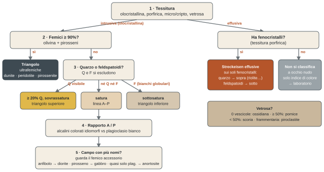
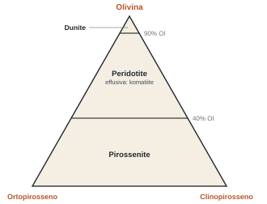

## Una prima classificazione

*Approccio speditivo: non si pretende di piazzare il campione esattamente nel campo del diagramma, ma di dargli un nome ragionevole. L'anno prossimo, a Petrografia, lo si farà in modo rigoroso.*

Lo schema della slide (da Marshak) mette in fila le rocce secondo il contenuto in silice, dalle **silicee (acide)** alle **intermedie**, alle **femiche**, alle **ultrafemiche**. Più cresce la silice, più la roccia è acida, leggera e chiara. Scendendo verso le ultrafemiche aumentano ferro, magnesio e **densità**, cala la silice, sale l'**indice di colore**. **\[ndr\]** In aula la silice è stata data "da un minimo del 40% fino al 60%". La scala di solito usata: ultrafemiche < 45%, femiche 45–52%, intermedie 52–63%, silicee > 63% (fino a circa il 75% nei graniti).

- Per ogni riga c'è un termine **effusivo** (micro/criptocristallino o porfirico) e il suo equivalente **intrusivo** (olocristallino, cristalli visibili a occhio nudo): granito–riolite, diorite–andesite, gabbro–basalto, peridotite–komatiite.
- Più si va verso il silicico, più la **composizione mineralogica è varia**. Verso l'ultrafemico si impoverisce, fino a rocce fatte praticamente solo di olivina.
- I minerali dello schema sono tutti quelli delle schede: feldspati alcalini, quarzo, plagioclasi, biotite, anfibolo, pirosseno, olivina.
- Il **plagioclasio** ha un campo molto ampio e cambia composizione: ricco in **calcio** nei termini femici, ricco in **sodio** in quelli silicici.

:::nota{etichetta="Due avvertenze"}
**I nomi sono storici** (soprattutto dell'Ottocento): non suggeriscono il tipo di roccia. Non vanno studiati a memoria: in laboratorio e all'esame si tiene sotto gli occhi il diagramma e si usa il nome del campo in cui si cade. Con l'uso ci si ricorda.

**L'indice di colore** (leucocratico, mesocratico, melanocratico, ultrafemico) va usato con molta cautela. Un'ultrafemica dovrebbe essere la roccia più scura, ma se è fatta di olivina fresca non è poi così nera.
:::

## Le rocce vetrose

### Frammentarie: le piroclastiti

Il nome "nobile" delle vetrose frammentarie è **rocce piroclastiche**, molto più usato di "frammentarie". Due grandi gruppi: i **tufi di caduta** e i **tufi saldati**, cioè i depositi di un flusso piroclastico che scorre lungo i versanti. Gli abitanti di Pompei sono stati travolti e sepolti da una nube piroclastica. In entrambi i casi il risultato è comunque un **tufo** in senso geologico.

:::esame{etichetta="Occhio alla nomenclatura"}
Nel linguaggio comune "tufo" indica cose diverse. Nelle Langhe "tufo" sono le marne, rocce sedimentarie su cui stanno le vigne, che non hanno nulla a che vedere con i tufi vulcanici. Verificare sempre che si stia usando la nomenclatura scientifica.
:::

Le piroclastiti nascono da un'attività vulcanica esplosiva che proietta grandi volumi di gas e frammenti di lava, sia ancora fusa (brandelli) sia già consolidata. I frammenti raffreddano rapidissimamente e ricadono (*fallout*), in atmosfera o colando lungo il cono. Per questo sono il punto di passaggio verso le sedimentarie, e si classificano con un triangolo **granulometrico**, come le sedimentarie clastiche:

| Classe | Dimensione |
| --- | --- |
| Blocchi e bombe | > 64 mm (le bombe sono i termini più grossolani) |
| Lapilli | 2–64 mm |
| Ceneri | < 2 mm |

*La registrazione si interrompe alle ceneri: la riga dei lapilli è la classe intermedia standard.*

- **Ialoclastite** (dall'inglese *hyaloclastite*): lava effusa in acqua, sotto un ghiacciaio o in sedimenti saturi d'acqua. L'interazione con l'acqua dà un raffreddamento rapidissimo e una contrazione: il materiale si frammenta in clasti angolosi, a spigoli vivi.
- **Autoclastite**: in generale, un fuso che si frammenta durante il consolidamento, in qualunque condizione.

### Non frammentarie

| Roccia | Vescicole | Note |
| --- | --- | --- |
| Ossidiana | praticamente zero | vetro vulcanico in senso stretto: magma talmente viscoso da non cristallizzare. Frattura concoide |
| Pomice | ≥ 50% del volume | lava ricchissima di gas. È così piena di vuoti che galleggia |
| Scoria | < 50% | stessa origine, meno vescicolare |

::campioni{id="ossidiana,pomice,scoria"}

Le vescicole sono il riflesso dei gas disciolti nel fuso.

## Il protocollo con i diagrammi triangolari

Ogni vertice è il 100% di un componente (end member); lungo ogni lato si legge la percentuale, e all'interno si incrociano le informazioni. Quest'anno le percentuali si stimano a occhio sul campione; l'anno prossimo si conteranno al microscopio.

### Femici ≥ 90%: le ultrafemiche

Prima cosa da valutare: la percentuale di femici. Se arriva al **90%** o più si usa il triangolo con olivina, ortopirosseno e clinopirosseno (che a occhio nudo si ragionano insieme). Tre nomi fondamentali:

- **Dunite**: olivina ≥ 90%.
- **Peridotite**: olivina tra 40 e 90%. Tra le più frequenti; equivalente effusivo la **komatiite**.
- **Pirossenite**: olivina < 40%, dominano i pirosseni.

::campioni{id="dunite,peridotite,pirossenite"}

### Femici < 90%: Streckeisen per le intrusive

Il doppio triangolo del petrografo **Streckeisen** ha quattro termini estremi: **Q** quarzo, **A** feldspati alcalini, **P** plagioclasi, **F** feldspatoidi. Ci entrano praticamente tutte le intrusive.

- **Q e F si escludono**: il 100% di Q è in cima, lo 0% sulla linea A–P; sotto quella linea non c'è quarzo, sopra non ci sono feldspatoidi. Il resto si può mescolare in qualunque proporzione.
- **La regola del 20%**: per semplificare si assume che se il quarzo si vede, è almeno il 20% della roccia. Sotto quella soglia non lo si vede a occhio nudo; lo si troverà in sezione sottile.
- Sopra il 20%: rocce **sovrassature** in silice. Sotto: al più **sature**. Scendendo nel triangolo inferiore si esce dalla saturazione e si va verso il femico.
- Poi si stimano A e P, si incrociano con Q e si trova il campo (ad esempio quello dei graniti). Stessa logica nel triangolo inferiore, con i feldspatoidi (i bianchi tondeggianti) al posto del quarzo.

:::definizione{etichetta="Sovrassaturazione, spiegata col tavolo"}
Una soluzione è sovrassatura quando un soluto è più concentrato di quanto il solvente possa tenere, e quindi precipita. Nel fuso è lo stesso: c'è talmente tanta silice che **tutti i minerali "si sono seduti al tavolo della silice"**, ne hanno presa quanta volevano e l'hanno messa nel reticolo. Quella avanzata cristallizza come **quarzo**. Se vedo quarzo, la silice era in abbondanza.
:::

### Il femico accessorio

I femici, in questi diagrammi, sono accessori: si aggiungono e di solito non cambiano il nome. Nei graniti c'è tipicamente biotite: "ci sono anch'io", ma non aggiunge molto. Servono invece nei campi in cui cadono **più nomi**, come la casella di diorite, gabbro e anortosite (stesse proporzioni di Q, A e P):

| Roccia | Cosa si vede oltre al plagioclasio |
| --- | --- |
| Diorite | **anfibolo**: prismi sottili e lunghi, aghetti, spesso a ciuffetti |
| Gabbro | **pirosseno**: prismi tozzi e robusti |
| Anortosite | quasi solo plagioclasio, abbondante e spesso colorato (anche violaceo), con pochissima mica, anfibolo o pirosseno |

::campioni{id="diorite,gabbro,anortosite"}

## Le effusive

:::esame{etichetta="Punto fermo"}
Una roccia effusiva, qualunque sia la sua tessitura, si classifica in modo corretto e rigoroso **solo dopo analisi di laboratorio**. Sul terreno si dà un primo nome e si porta il campione in laboratorio.
:::

- Il triangolo di Streckeisen per le effusive ha gli stessi vertici, ma si può usare a occhio solo con **tessitura porfirica**, ragionando sui **fenocristalli**: prima si cerca quarzo o feldspatoidi, poi si valuta A rispetto a P. La nomenclatura è più semplice, perché ci sono meno suddivisioni.
- Con tessitura **micro o criptocristallina** si fa quello che si può: indice di colore, al massimo qualche microcristallo con la lente.
- Nei termini femici distinguere a occhio un'**andesite** da un **basalto** è molto difficile: i fenocristalli sono quasi tutti plagioclasio. Aiuta un po' l'indice di colore (le andesiti sono più chiare), ma è molto empirico.

## In aula: il ragionamento sui campioni

*"Dovete discutere con la roccia." E non dite sì solo per far contento il prof: in laboratorio e all'esame lo farete da soli.*

#### 1 · Granito

Cristalli di dimensioni discrete: olocristallina, intrusiva. Leucocratica, tende al bianco: probabile roccia silicica, quindi femici sotto il 90% e Streckeisen. Si vede il **quarzo**: niente feldspatoidi, triangolo superiore, sovrassatura. Il quarzo è tutto? No, e nessuno pensa sia oltre il 60%: siamo tra il 20 e il 60%. A quel punto il quarzo "ha dato tutte le informazioni che poteva". Restano A e P: i **feldspati alcalini** sono tabulari, spesso idiomorfi, colorati e con la geminazione che riflette la luce "a tavole"; il **plagioclasio** è bianco, allotriomorfo, riempie gli spazi. Qui prevalgono gli alcalini: si escludono granodiorite e tonalite, e gli alcalini non sono così tanti da essere un granito a feldspato alcalino. È un **granito** (A e P circa equivalenti: monzogranito; prevalgono un po' gli alcalini: sienogranito). C'è una mica nera, probabilmente biotite: si mette nell'elenco dei minerali, ma non serve al nome. "Se diciamo che è un granito, siamo già a posto."

::campioni{id="granito"}

#### 2 · Gabbro

Grandi cristalli, anche centimetrici: olocristallina, intrusiva. Indice di colore intermedio, non melanocratico: niente triangolo delle ultrafemiche. Non si vedono né quarzo né feldspatoidi: siamo vicini alla linea A–P (attenzione: il quarzo potrebbe esserci in cristalli troppo piccoli, se la roccia è solo satura). Feldspati alcalini non se ne vedono, solo roba bianca, quindi domina il plagioclasio: angolo P, casella di diorite, gabbro e anortosite. Il nero è troppo per un'anortosite. Il femico è **tozzo e robusto**, non a aghetti o ciuffetti: **pirosseno**, quindi **gabbro**. Con l'anfibolo sarebbe stata una diorite.

::campioni{id="gabbro"}

#### 3 · Effusiva porfirica vescicolare con feldspatoidi

Ha le vescicole, ma anche dei **cristalli bianchi**: è porfirica, quindi non è una scoria (una scoria non avrebbe fenocristalli). Si usa lo Streckeisen per le effusive. Quarzo niente; si vedono **feldspatoidi**, bianchi e globulari: triangolo inferiore, verso il fondo, più o meno nel campo delle **tefriti**. "Tutto quello che possiamo fare con una roccia di questo tipo è quello."

::campioni{id="tefrite"}

#### 4 · Riolite

Porfirica: grandi individui in una pasta di fondo. Tra i fenocristalli c'è il **quarzo**, anche se poco ("gli vogliamo bene? Sì: anche se è poco, vuol dire che siamo da qui in su"). Ci sono anche fenocristalli prismatici colorati, quindi non siamo nell'angolo del quarzo: **riolite**. Il campo della riolite è lo stesso del granito: la riolite è il suo **equivalente effusivo**.

::campioni{id="riolite,granito"}

#### 5 · Effusiva scura senza fenocristalli

Effusiva, probabilmente femica per il colore scuro, con vescicole piccolissime. Ma **non ha fenocristalli**: a occhio nudo non si può classificare, ci si ferma.

## Da fare

- [ ] Stampare o tenere sul tablet i diagrammi delle ultrafemiche e di Streckeisen (intrusive ed effusive): si usano in laboratorio e all'esame. I nomi non si studiano a memoria.
- [ ] Ridisegnare il diagramma di flusso del metodo e provarlo a voce su un campione immaginario.
- [ ] Fissare le coppie diorite/anfibolo, gabbro/pirosseno, anortosite/quasi solo plagioclasio.
- [ ] Chi non ha ancora mandato l'attestato del corso sicurezza da 4 ore: mandarlo al prof.
- [ ] Il consiglio del prof sugli esami del primo anno: dare priorità a **chimica** (frequentare, studiare, fare tutti i laboratori), poi matematica e fisica. Il docente di chimica è molto disponibile, "ma dovete esserci".

### Prossima lezione con Piazza

Lunedì.
