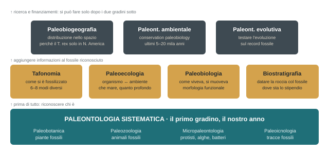
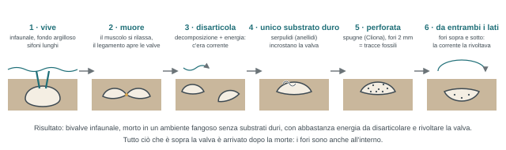

## Come funziona il corso

*Un corso, due platee, due Aulaweb. La prima ora è servita a mettere in ordine la logistica di tutto l'anno.*

### Due corsi in uno

|  | GEO (Paleontologia, 64866) | NAT (Geologia e Paleontologia, 84450) |
| --- | --- | --- |
| CFU | 9 | 6 (il resto è il modulo di geologia) |
| Lezione | 54 ore | 34 ore |
| Esercitazione | 30 ore | 28 ore |
| Terreno | 14 ore, cioè due giorni (uno in comune con NAT) | 7 ore, un giorno |
| Fine lezioni | Fine maggio (storia della vita sulla Terra) | Inizio aprile (dopo i microscopi) |

L'insegnamento nasce per Scienze Geologiche; una parte viene mutuata da Naturali, che quindi hanno meno appuntamenti e meno slide. Le lezioni marcate GEO nel calendario valgono per i CFU solo dei geologi (i naturali possono comunque venire: lezioni aperte). Ci si iscrive all'**Aulaweb del proprio corso** e ci si cancella dall'altro: Aulaweb è il canale ufficiale per annunci, slide e materiali.

### Fogli firma: a cosa servono

Non è un corso a frequenza obbligatoria e le firme non servono a controllare chi è bravo. Servono a tre cose pratiche:

- **Sicurezza.** Ai laboratori (tra 2–3 settimane) si accede solo con il corso sicurezza completo: 4 ore online + 8 ore in presenza. Le firme gli permettono di controllare chi è in regola.
- **Turni al microscopio.** Nel secondo semestre l'aula microscopi tiene 25 persone; su circa 60 iscritti, se seguono tutti servono tre turni, se seguono in cinque ne basta uno.
- **Pullman per il terreno** (aprile–maggio). Si prenota per chi frequenta davvero, non per gli iscritti: in passato si sono buttati 800 € per un pullman vuoto. Chi non è mai venuto non partecipa alle uscite.

Due fogli separati, uno NAT e uno GEO: firmare una volta sola, sul foglio giusto, e non per gli amici.

### Orario, aula, emergenze

- **Giovedì 9–11** e **venerdì 14–16**, aula 401 (C4.01). Schema fisso: il giovedì la teoria su un gruppo (es. trilobiti), il venerdì due ore di esercitazione sugli stessi fossili. Se salta un giorno, la pratica scivola alla settimana dopo.
- L'aula 401 permette di fare lezione anche con allerta gialla o arancione. Con **allerta rossa** la didattica chiude e si passa su Teams, codice canale **0n5ps9z**.
- Slide già su Aulaweb, ma vengono aggiornate il giorno prima di ogni lezione (ogni anno riscrive metà o tre quarti del materiale): non scaricare tutto subito.
- Programma completo: corsi.unige.it/off.f/2025/ins/83496. Laboratorio di paleontologia: paleolab.unige.it, @paleolab.unige (ricerca, tesi, tirocini: utile fra due anni).
- Per dubbi: alzare la mano, mail, ufficio, Teams. È in ufficio tutti i giorni.

### Il calendario (provvisorio) fino a gennaio

Lo carica negli annunci Aulaweb tra oggi e domani. Può cambiare: se l'escursione delle matricole di Geologia 1 (metà–fine ottobre, probabilmente mercoledì o giovedì) cade di giovedì, salta una data. Il **2 ottobre** non c'è lezione (motivo non ricordato), l'**11 dicembre** nemmeno (congresso a Vienna).

| Date | Per chi | Argomento |
| --- | --- | --- |
| 24–25 set | TUTTI | Introduzione · Paleontologia e tempo |
| 1 ott | TUTTI | Ambienti, paleoecologia, morfologia funzionale (2 ott: no lezione) |
| 8–9 ott | **GEO** | Sistematica ed evoluzione · Biozone e fossili guida (datare le rocce coi fossili) |
| 15–16 ott | TUTTI | Fossilizzazione e trasporto (tafonomia): prima esercitazione |
| 22–23 ott | TUTTI | Poriferi, archeociati, celenterati |
| 29–30 ott | TUTTI | Brachiopoda, Bryozoa |
| 5–6 nov | TUTTI | Mollusca 1: Polyplacophora, Bivalvia |
| 12–13 nov | TUTTI | Mollusca 2–3: nautiloidi, ammonoidi, coleoidi |
| 19–20 nov | TUTTI | Mollusca 3: cefalopodi · Mollusca 4: Gastropoda |
| 26–27 nov | TUTTI | Gastropoda · Tracce fossili |
| 3–4 dic | GEO / TUTTI | Tracce fossili in chiave paleoambientale (GEO) · esercitazione tracce |
| 10 dic | — | Da definire (11 dic: no lezione) |
| 17–18 dic | TUTTI | Arthropoda, Ostracoda |
| 7–8 gen | TUTTI | Echinodermata, Hemichordata (giovedì in AT02) |
| 14–15 gen | TUTTI | Piante (giovedì in AT02) |

### Secondo semestre

- Pausa esami da metà gennaio a fine febbraio. Da marzo **microscopi**: 2 ore di teoria + turni in aula microscopi. In totale 8 ore di esercitazione, ma ciascuno ne fa **due**, scegliendo la propria slot in una tabella esterna (9–11, 11–13, 14–16). Chi si segna e non viene finisce in lista nera.
- Per NAT le "6 ore di paleontologia" a calendario del secondo semestre sono in realtà due: il venerdì è tenuto libero per le attività di terreno.
- Dopo i microscopi NAT ha finito (inizio aprile). GEO continua fino a fine maggio con la **storia della vita sulla Terra**: dall'Archeano all'Antropocene, intervallo per intervallo, con le mappe paleogeografiche (3 CFU in più).
- Uscite sul terreno ad aprile–maggio, quando il tempo lo permette. Una sarà nell'entroterra dietro Savona: una barriera corallina fossile a 500 m di quota, tra bosco e cinghiali.

### La collezione didattica e il tutor

Tutti i fossili che si vedono a lezione (circa 1500) stanno in armadi al **piano terra del Palazzo delle Scienze**, nel corridoio verso l'amministrazione vicino agli ascensori (stanze CTI 08–09). Ogni armadio ha due colonne da 18 cassetti; dentro ci sono vaschette con un cartellino e il codice del fossile, e ogni vaschetta ha la sua posizione segnata sul vassoio. Le **chiavi si chiedono in ufficio** (I piano, o al tutor **Luca**, dottorando nel laboratorio accanto, presente a tutte le esercitazioni) scrivendo prima una mail per concordare il giorno. Si può passare mezza giornata o una giornata a ripassare con i cassetti aperti: è l'opzione più utile prima dell'esame. Da febbraio vale anche per i vetrini dei microfossili, nelle aule dedicate.

:::nota{etichetta="Regola d'oro"}
Ordine "quasi maniacale": ogni fossile torna nella sua vaschetta e la vaschetta nel suo cassetto. Durante le esercitazioni controllare sempre che il codice sul fossile sia quello del cartellino e del cassetto, altrimenti ci si ritrova una trilobite nel cassetto delle spugne.
:::

## L'esame

*Orale, tre fasi in sequenza, e una domanda che torna sempre: perché?*

:::esame
**1\. Prova di sbarramento al microscopio** (dal 2° semestre in avanti è la prima domanda). Un vetrino: accendere il microscopio, mettere a fuoco con entrambi gli oculari, cambiare ingrandimento, cercare un microfossile a scelta e dire chi è, quanti milioni di anni ha, in che ambiente viveva. Tre minuti. Chi non sa mettere a fuoco o cambiare ingrandimento si alza e se ne va: la prova si perde quasi sempre per il microscopio, non per il fossile.

**2\. Campioni macroscopici**: si parte da 3 (fino a 5 se uno non lo si riconosce), 5–10 minuti ciascuno. Per ogni campione: descrizione della morfologia, nome, modalità di fossilizzazione, biologia dell'organismo, ambiente deposizionale, età; per GEO anche l'inquadramento paleogeografico.

**3\. Domande di teoria** sulle prime 5–6 lezioni (per tutti: evoluzione, genere, famiglia, omologia e analogia, processi di fossilizzazione); per GEO anche sulla parte finale, la storia della vita: data una mappa paleogeografica, riconoscere che è il Triassico e "mettere i soldatini nel posto giusto".

Durata 20–40 minuti. Prima domanda tipica: "su che libro hai studiato?", per calibrare le domande sul testo.
:::

### Il metodo del perché

Davanti a un sasso non si dice "è un corallo". Si dice: vedo 1, 2, 3, 4, 5 cose, queste sono tipiche dei coralli, quindi è un corallo. Se non si vedono tutti i caratteri va bene fermarsi a "corallo o spugna, perché vedo due cose comuni a entrambi". Il rischio di chi memorizza le foto è vedere la "foto 350" e dire trilobite quando ha davanti un riccio di mare. Poi la seconda domanda: *perché* è una trilobite? Non perché vivevano nel Paleozoico o nel mare, ma per la morfologia. Descrizione → nome → come si è fossilizzato → ambiente → distribuzione stratigrafica.

I fossili sono circa 1500 ma non vanno saputi genere e specie: si vedono 200–300 ammoniti per imparare i caratteri morfologici che identificano il gruppo, e all'esame se ne dà una.

### Appelli e prenotazioni

- Appelli già inseriti: gennaio–febbraio (consiglio: andare ad assistere, per vedere come funziona), giugno, luglio, settembre; agosto forse.
- Prenotazione entro 5 giorni. La data dell'appello è solo l'appello: da lì l'esame può distribuirsi su più giorni, con elenchi mandati per mail 4–5 giorni prima e slot a scelta in base agli impegni.
- Quando ci si prenota, mail per fissare il ripasso sulla collezione.

### Compitini (solo NAT, facoltativi)

Proposta non ufficiale, già provata l'anno scorso: a ogni esercitazione una scheda con crocette e spazio per disegnare i fossili (età, ambiente, modo di vita, fossilizzazione). Due compitini, uno nella pausa gennaio–febbraio e uno a fine corso: 3 fossili con la stessa scheda, nome ed età a mano, 3 domande aperte. Chi li fa, all'esame porta solo i 3 minuti di microscopio. L'anno scorso li hanno fatti 7 su 40, tutti con voto da 28 in su. Un compitino superato si mantiene anche se non si fa l'altro. Si organizza se c'è un gruppo abbastanza numeroso.

### Come prepararsi

- [ ] Venire alle esercitazioni, dopo aver visto la teoria (le slide almeno).
- [ ] Scegliere e leggere almeno un libro di testo.
- [ ] Studiare sulla collezione didattica: appuntamento per le chiavi, aula studio, tutto in ordine sistematico.
- [ ] Ripassare i vetrini in sezione sottile nelle aule dedicate.
- [ ] Le slide sono immagini più che testo: bastano se si frequenta, non sostituiscono il libro per chi non frequenta.

## Libri di testo

*Nessuno è obbligatorio, uno vale l'altro; i PDF dell'80% sono su Aulaweb (cartella a tempo). Tutti sono in biblioteca e si possono sfogliare nel suo ufficio prima di scegliere.*

| Testo | Note del docente |
| --- | --- |
| Benton & Harper, *Introduction to Paleobiology and the Fossil Record* | Il più completo, vivamente consigliato, in inglese. Copre l'80% del corso; molte immagini delle slide vengono da qui. Molto dettagliato nella parte iniziale (quattro capitoli di tafonomia contro le nostre due ore). |
| Società Paleontologica Italiana, *Manuale di Paleontologia* | In italiano, recente, molto sintetico: poche pagine per gruppo, l'essenziale. Copre il 60–70%. In biblioteca, non su Aulaweb. |
| Gradstein et al., *Fossils and Earth Time* (Elsevier, 2025) | Uscito da poco, sintetico, belle immagini, autori di peso. |
| Raffi–Serpagli · Allasinaz · Malaroda | Il "vintage" in italiano, anni '70: classificazione desueta, ma Allasinaz resta ottimo per gli invertebrati. Se non si trova altro vanno bene. |
| Armstrong & Brasier, *Microfossils* | Per la parte al microscopio: un po' vecchiotto ma c'è tutto. |
| Taylor, Taylor & Krings, *Paleobotany* | Per le piante, consigliato soprattutto ai naturalisti. Lo detesta con tutto il cuore, ma è un bel libro sull'evoluzione delle piante. |
| Barsotti, Gnoli & Guerrini, *Storia naturale del pianeta Terra* (2 voll.) | GEO. In italiano e recente, ma divulgativo e poco scientifico, da scuola superiore: soluzione per chi fatica con l'inglese. |
| Torsvik & Cocks, *Earth History and Palaeogeography* | GEO. La fonte principale delle mappe paleogeografiche della parte finale del corso. |
| Gradstein et al., *Geologic Time Scale 2020* (2 voll.) | GEO. "La Bibbia del geologo": vol. 1 i metodi di studio del tempo, vol. 2 la storia della Terra dall'Archeano all'Antropocene. Aggiornato ogni 4–5 anni. |

## Che cos'è la paleontologia

*Definizioni dalle slide, e la mappa degli ambiti che il docente ha costruito per far vedere cosa c'è oltre questo corso.*

:::definizione
**Paleontologia**: il ramo della scienza che studia la vita nel passato. Dal greco *palaiós* (antico) + *óntos* (essere) + *lógos* (studio).

**Fossile**: qualsiasi resto o traccia di animale o vegetale vissuto in epoche antecedenti all'attuale. Dal latino *fossilis*, "che si scava dalla terra".

**Body fossils**: resti mineralizzati o scheletrici dell'organismo (conchiglia, osso, dente). **Trace fossils**: tracce dell'attività dell'organismo, senza parti dell'organismo stesso: impronte, tane, tunnel, ma anche le perforazioni (borings) fatte in un guscio altrui. Sono complementari: alcune informazioni le dà solo il corpo, altre solo la traccia. Una traccia è tale se l'organismo l'ha prodotta attivamente: l'impronta lasciata da una conchiglia che semplicemente giaceva sul fondo non è una traccia.
:::

### Due note per gradino

- **Sistematica.** È quello che fanno tutti i corsi base nel mondo, ed è lo "zoccolo duro" dell'anno. Per i naturalisti non è una ripetizione di zoologia: la diversità del record fossile è molto più ampia, e molti organismi (coralli e spugne del Paleozoico su tutti) non assomigliano a niente di quello che si è visto.
- **Paleoecologia.** Nel bosco basta guardarsi intorno; con un sasso e una foglia sopra bisogna capire se era bosco, palude, argine di fiume o roba finita in mare. Sul terreno la domanda non sarà "c'era il mare?" ma: che mare, quanto profondo, con onde o senza, quanto ossigeno, quanta luce. Coralli ramosi rotti e coralli massicci interi raccontano l'energia dell'ambiente. Le domande che un biologo marino risolve con maschera e computer da polso, qui vanno ricostruite.
- **Paleobiologia.** Come si riproduceva il T. rex, come facevano la muta le trilobiti, come nuotavano. Parte dalla morfologia funzionale.
- **Biostratigrafia.** Il grosso dei paleontologi che lavorano fa questo. Servono organismi con evoluzione rapida (cambiano specie ogni mezzo milione di anni), spesso piccoli: da qui la micropaleontologia. Un corallo dice "mare, poco profondo" ma resta uguale per 80 milioni di anni: non data. Il T. rex dice "Cretacico terminale, 65–66 Ma": troppo poco preciso per essere un fossile guida (e non è del Giurassico: *Jurassic Park* è un titolo, non una datazione).
- **Tafonomia.** Un T. rex a 2000 m di profondità è improbabile: per arrivarci dovrebbe subire una catena di eventi (piena, spiaggia, tsunami, lago, fiume, canyon sottomarino) che difficilmente lascia un fossile. Sarà la prima lezione di sistematica, perché serve per tutti i fossili dell'anno.
- **Paleobiogeografia.** La biogeografia di Wallace (la linea di Wallace tra Bali e Lombok) applicata al passato: perché il T. rex solo in Nord America, perché in Italia solo Ciro.
- **Paleontologia ambientale.** Stessa metodologia del Giurassico applicata agli ultimi 5–20 mila anni: per capire se l'area protetta di Portofino funziona, si può leggere nel record paleontologico quanta posidonia c'era 5 mila anni fa, non solo quanta ne cresce oggi. Molti finanziamenti.
- **Paleontologia evolutiva.** I link mancanti, quando è avvenuta una diversificazione, quando sono comparsi i primi batteri: si testa sul record fossile. Più teorica, meno terreno.

## Leggere un fossile: il gioco con le immagini

*La seconda ora è stata un'esercitazione mascherata. Sei immagini, e da ognuna tirare fuori tutto quello che si può.*

### Il T. rex intero

Vertebrato (ha vertebre, ossa). Carnivoro (denti conici, appuntiti, seghettati). Predatore attivo, non saprofago: visione frontale, ma la visione frontale da sola non basta; arti posteriori possenti (anche l'elefante li ha, però il T. rex sta su due gambe e le deve usare per tenere ferma la preda). Dalle ossa si stima la biomeccanica: quanti chilonewton reggevano gli arti per un animale di un paio di tonnellate, quindi a che velocità andava, quindi se superava il triceratopo.

Ma "il corpo è fatto per muoversi bene" è un'osservazione viziata dall'immagine: la ricostruzione l'abbiamo fatta noi. Fino a 40–50 anni fa il T. rex stava in piedi come Godzilla, con la coda appoggiata a terra: provate a farlo correre così. Cosa ha cambiato le ricostruzioni sono state le **tracce fossili**: negli anni '40–50 l'industria petrolifera ha finanziato l'icnologia (le tracce servono a ricostruire i reservoir) e si sono studiate migliaia di piste di grandi vertebrati. Camminate, corse, di tutto: **mai un'impronta di coda**, che invece lasciano varani, iguane e perfino le tartarughe sulla sabbia. Quindi la coda non toccava terra. Da lì la coda si è sollevata in tutti i musei, i chilonewton sono cambiati, il bacino pure, e finalmente il T. rex può correre. Body fossils e trace fossils sono complementari: la biomeccanica dal solo scheletro non ci sarebbe mai arrivata.

### Il dente isolato

Se dal frammento riconosco l'organismo, è come avere l'organismo intero: dietro quel dente c'era tutto il T. rex, e posso rifare lo stesso ragionamento. Cambia solo la tafonomia: perché c'è il dente e non il resto? Attenzione al contesto biologico: un dente di squalo isolato è normale (gli squali ne perdono in continuazione, non serve immaginare trasporti); un dente di T. rex senza mascella racconta invece un evento, una collutazione, un morso andato male.

### L'impronta della conchiglia

Non c'è la conchiglia: c'è la sua impronta. Non è una traccia fossile (l'organismo non ha fatto nulla attivamente). Sequenza necessaria: il bivalve muore su un fondale morbido e vi lascia la forma; il sedimento litifica prendendo la morfologia esterna; poi il guscio si dissolve e la roccia no. Ma sono entrambi carbonato di calcio. La differenza è mineralogica: il guscio dei bivalvi è in gran parte **aragonite**, forma meno stabile della calcite, che con fluidi leggermente acidi si scioglie per prima. Quanta tafonomia in un'impronta.

### Le orme del teropode

Un grande teropode (7–8 metri, tipo allosauro) che si muove in una direzione. Dalla distanza tra le impronte, con formule semplici, si stima l'altezza e se camminava o correva, con la cautela che il substrato (sabbia dura, fango) può alterare la lettura. Il substrato è pieno di **ripple marks**, le ondulazioni che il moto ondoso crea sulla sabbia: si vedono con maschera e pinne su qualunque fondale sabbioso ligure. Le orme tagliano i ripple, quindi vengono dopo: prima il mare, poi la **marea** si ritira e l'animale cammina sulla piana tidale (come in Bretagna o in Nord Francia; a Rimini in bassa marea la puzza di organismi in decomposizione dà l'idea). Perché ci va? Per mangiare: non le telline, ma chi viene a mangiare le telline, cioè la catena trofica di media taglia che si concentra sui banchi esposti. Solitario o gregario? Da una pista sola non si dice; con 5–8 piste parallele sì, e ci sono siti anche in Italia. Conservazione: il sedimento fine (sabbia fina, fango) che ricopre subito crea il velo che protegge la morfologia; se la copertura è più dura del substrato, erodendo resta il controcalco.

### La vongola crivellata

Una valva sola di vongola, con vermetti bianchi incrostanti e centinaia di forellini. Il compito era ricostruire la storia dall'inizio ("Sherlock, parlate col vostro Watson").

#### I caratteri che hanno sbloccato la storia

- **Impronte muscolari** (le "gocce"): dove si attaccano i muscoli adduttori, gli unici che *chiudono* le valve. Le vongole ne hanno due, cozze, ostriche e capesante una (guardare stasera negli spaghetti allo scoglio).
- **Legamento**: organico, dietro la cerniera, tende sempre ad *aprire*. Quando il muscolo si rilassa (morte, padella) il legamento vince e le valve si aprono; poi si decompone e le valve si disarticolano.
- **Linea palleale**: corre tra le due impronte muscolari e segna il limite del mantello. La sua rientranza, il **seno palleale**, è dove rientrano i sifoni (inalante ed esalante) quando l'animale si chiude. Il sifone è organico e non fossilizza, ma il seno sì: **più profondo il seno, più lunghi i sifoni, più infossato l'organismo**. Chi vive in acqua libera (cozze, ostriche) non ha bisogno di sifoni lunghi. Qui il seno era pronunciato: infaunale, quindi substrato molle.
- **Serpulidi**: anellidi che incrostano superfici carbonatiche, i vermetti bianchi delle cozze. **Cliona**: spugna perforante che si scava casa in gusci e substrati calcarei, fori perfettamente circolari di circa 2 mm (troppo regolari e piccoli per essere altro). Tanti tutti insieme significa che quella valva era l'unico substrato duro disponibile.

### Il gasteropode predato

Storia triste: infanzia difficile e divorzio. Il **foro circolare**, uno solo di solito, cilindrico o leggermente conico, è opera di altri molluschi predatori (perfino cannibali) che perforano il guscio, uccidono e succhiano: lì è morto. Ma prima, sull'ornamentazione c'è una **rottura a cuspidi** con sotto una nuova mineralizzazione: un granchio ha rotto il guscio con le chele, l'animale si è ritirato nella columella, il granchio ha desistito e il gasteropode ha ricostruito il guscio. Un foro nella parte apicale, dove il corpo è sempre attaccato, non lascia scampo; su organismi grandi un foro nella columella può non essere letale. I fori richiedono ore di lavoro in condizioni non sicure: spesso si trovano **fori incompleti**, predatori che hanno rinunciato. In una collezione di gasteropodi, moderna o fossile, il 30–40% porta segni di predazione, attacco, salvezza, ricrescita: da qui partono molti lavori di paleoecologia, per 600 milioni di anni di interazioni.

:::disegna
Una valva di bivalve vista dall'interno con cerniera, legamento, due impronte muscolari, linea palleale e seno palleale, con accanto i sifoni. E la storia tafonomica della vongola in sei passaggi.
:::

## Da fare

- [ ] Verificare di essere iscritto solo all'Aulaweb di Paleontologia 64866 (GEO) e di aver firmato sul foglio GEO.
- [ ] Controllare lo stato del corso sicurezza (4 h online + 8 h in presenza): serve per i laboratori tra 2–3 settimane.
- [ ] Salvare il codice Teams 0n5ps9z per le allerte rosse.
- [ ] Scaricare le slide della lezione il giorno stesso, non tutte in anticipo.
- [ ] Scegliere un libro (Benton & Harper o il Manuale SPI) e guardarlo su Aulaweb prima che la cartella sparisca.
- [ ] Segnare 8–9 ottobre (solo GEO: sistematica, evoluzione, biozone, fossili guida) e il salto del 2 ottobre.
- [ ] Prima esercitazione vera: 15–16 ottobre, fossilizzazione e trasporto.
- [ ] Rispondere al ripasso: mail per le chiavi degli armadi quando serve, sempre con anticipo.

### Prossima lezione

Venerdì 25 settembre, 14–16, aula 401: paleontologia e tempo.
