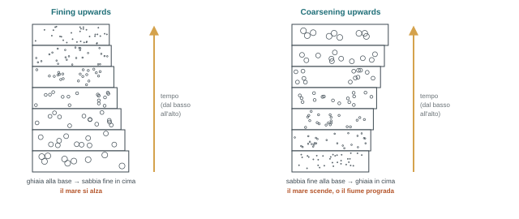
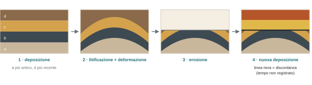

## La scala cronostratigrafica internazionale

*Lo strumento da avere sempre sotto mano, in paleontologia e per i prossimi cinque anni. Prima si impara a leggerla, meglio è.*

La **International Chronostratigraphic Chart** della International Commission on Stratigraphy (stratigraphy.org) è lo standard, costantemente aggiornato, di tutti i termini e le età del tempo geologico. Quella in slide è del 2021; l'ultima versione (2026) è di fatto identica alla 2025. Cosa cambia tra una versione e l'altra: soprattutto le **età numeriche** e i loro errori, che si affinano con tecnologie migliori e nuovi affioramenti. Per questo non serve inseguire ogni aggiornamento.

La scala sarebbe una lunga colonna stretta e verticale; per leggerla la si taglia in quattro colonne affiancate. La "torta" colorata con lo pterodattilo della prima lezione è la versione giocosa, piena di errori: le proporzioni sono sbagliate (4 miliardi di anni in 15 cm e 500 milioni in un metro e mezzo), mancano le suddivisioni secondarie, e il Carbonifero è diviso in Mississippiano e Pennsylvaniano, che è la convenzione nordamericana. Nella scala internazionale sono due sottoperiodi del **Carbonifero**. (E Mississippi ha due p, anche in italiano.)

:::esame{etichetta="Metodo"}
Il tempo si studia **dal più antico al più recente**, da pagina 1 all'ultima: Triassico, Giurassico, Cretacico, Paleocene, Eocene… e non al contrario. Non va imparata a memoria tutta la scala, ma alcuni termini sono fondamentali, e riconoscere al volo dove sta un piano (il Pliensbachiano? Giurassico inferiore, a metà) aiuta tutto il corso. I piani non vengono chiesti all'esame.
:::

### Le grandi suddivisioni

- **Precambriano**: dall'inizio della storia geologica (circa 4,5 miliardi di anni) fino alla base del Cambriano, circa 540 Ma. Qui la vita non si "vede": ci sono batteri, e non si conservano nemmeno loro, ma solo i prodotti della loro attività, come le **stromatoliti** (strutture carbonatiche costruite da comunità batteriche, si vedranno a febbraio–marzo). **\[ndr\]** È la semplificazione adottata dal corso: prima del Cambriano esistono già eucarioti e organismi pluricellulari, come mostra anche la spirale del tempo in slide, e c'è la **fauna di Ediacara** (circa 575–539 Ma), organismi pluricellulari a corpo molle. Con il Cambriano compaiono però in massa gusci e scheletri, cioè la vita diventa ben visibile nel record.
- **Fanerozoico** (dal greco *phanerós*, visibile, + *zôon*, animale): "il tempo in cui si vedono gli animali". Dal Cambriano a oggi, diviso in tre ere.
- **Paleozoico**: animali antichi, molto diversi da quelli attuali, molti estinti. **Mesozoico**: animali "a metà". **Cenozoico** (da *kainós*, nuovo): i fossili sono molto simili agli animali di oggi. La suddivisione principale della scala è quindi fortemente paleontologica.

| Era | Periodi (dal più antico) | Da ricordare |
| --- | --- | --- |
| Paleozoico | Cambriano · Ordoviciano · Siluriano · Devoniano · Carbonifero · Permiano | Cambriano: la vita si vede. Fine Devoniano: una delle grandi estinzioni di massa. Carbonifero: strati ricchi di carbone, per le prime foreste in ambienti paludosi che conservano la materia organica. Fine Permiano: la più grande estinzione degli ultimi 500 Ma |
| Mesozoico | Triassico · Giurassico · Cretacico | In italiano si dice **Cretacico**, non "Cretaceo" (Commissione italiana di stratigrafia) |
| Cenozoico | Paleogene (Paleocene, Eocene, Oligocene) · Neogene (Miocene, Pliocene) · Quaternario (Pleistocene, Olocene) | Fine Cretacico: estinzione K–T, 66 Ma |

### La risoluzione: dall'era al piano

Accanto a ogni periodo ci sono intervalli via via più sottili: i **piani** sono la massima risoluzione della scala. È come dire dov'è il DISTAV: in Europa, in Italia, in Liguria, a Genova, a San Martino. Si usa il livello di dettaglio che serve, e che i fossili permettono. Dal Mesozoico in poi la risoluzione è alta (tanta vita, rocce vicine a noi); nel Paleozoico è più bassa, anche perché in Europa le rocce paleozoiche sono più rare.

I nomi dei piani vengono spesso da **località** dove quell'intervallo affiora in modo esemplare. Oxfordiano da Oxford; nel Miocene Aquitaniano (Aquitania, Bordeaux), Burdigaliano, Langhiano (Langhe), Serravalliano (Serravalle Scrivia), Tortoniano (Tortona), Messiniano (Messina). Così un geologo di qualsiasi paese dice "Tortoniano" per il Miocene superiore non terminale.

:::nota{etichetta="Consiglio pratico"}
Chi cerca ammoniti deve cercare sedimenti del **Toarciano**, parte alta del Giurassico inferiore: in Toscana, Emilia-Romagna, Liguria meridionale (La Spezia), Umbria e Marche ce ne sono enormi affioramenti, e in collezione ci saranno almeno due o tre cassetti di ammoniti toarciane.
:::

**TimeScale Creator** (timescalecreator.org, gratuito): costruisce scale stratigrafiche su misura, da un piano a un altro, e propone solo i gruppi presenti in quell'intervallo (dal Toarciano al Turoniano ci sono i dinosauri, le trilobiti no: estinte alla fine del Permiano). Contiene anche le ricostruzioni paleogeografiche intervallo per intervallo. Molte scale del corso sono fatte con questo.

## Fossili, rocce e tempo

*I fossili stanno (solo) nelle rocce sedimentarie. Servono rudimenti di stratigrafia, geologia e sedimentologia.*

:::esame
Se hai in mano un fossile, la roccia non è magmatica né metamorfica. Errore frequente (circa un esame su tre, soprattutto tra i naturalisti): una foglia fossile su una roccia nera e scura viene chiamata "basalto". Una foglia perfettamente conservata su una lava è impossibile: è quasi sempre un pezzo di **carbone**. Non partire in panico con la prima roccia nera che viene in mente.
:::

:::definizione
**Stratigrafia**: studia la collocazione nello spazio e nel tempo delle rocce e degli avvenimenti in esse registrati. Obiettivo: fornire un quadro temporale alle Scienze della Terra per collocare gli eventi in successione cronologica e ricostruire la storia della crosta.

**Successione**: collocazione di avvenimenti distinti nel tempo, inteso come unidirezionale e irreversibile. **Durata**: quantificazione dell'intervallo durante il quale si svolge un evento. **Contemporaneità**: grado di sincronia di avvenimenti diversi, quindi la loro correlabilità.
:::

In una successione sedimentaria vedo lo scorrere del tempo e posso stimarne la durata complessiva. Non so però quanto tempo passa tra una deposizione e l'altra: l'unica risoluzione a cui posso aspirare è quella dei fossili contenuti. Se un fossile ha una **distribuzione stratigrafica molto corta**, dico che lo strato si è depositato in quell'intervallo; ma se in fretta o lentamente non lo so, e se nello strato sopra trovo un fossile della stessa età so solo che uno viene dopo l'altro, non la velocità di sedimentazione.

- La paleontologia non è l'unico metodo di datazione, ma è il più **speditivo ed economico**, ed è quello usato di continuo. Per l'età puntuale di una roccia servono i radioisotopi. Il carbonio-14 in geologia non si usa: funziona fino a 50–60 mila anni, l'errore sarebbe troppo grande; si usano altri radioisotopi.
- Quasi sempre però serve l'età di un'intera **successione**, non di un punto: sono due approcci diversi (vedi sezione 05).
- **Correlazione stratigrafica**: se in una successione riconosco bene tutti i fossili e in una vicina solo alcuni, posso trasferire le età. Se lo strato col T. rex sta tra quello con lo stegosauro e quello coi molluschi, e accanto trovo solo stegosauro e molluschi, in mezzo doveva esserci l'intervallo del T. rex anche se non lo vedo. È una chiave della prospezione del sottosuolo.

## I principi stratigrafici usati in paleontologia

### Orizzontalità originaria

Le rocce sedimentarie nascono da materiale trasportato e depositato (o biomineralizzato) su fondali che, a grandissima scala, sono **piatti e orizzontali**, per quanto a piccola scala abbiano ripple, piattaforma, scarpata e piana abissale. Gli strati quindi nascono planari e orizzontali. Se li trovo inclinati o piegati, qualche forza li ha deformati dopo (Monte Fasce, Monte Moro; la passeggiata di Nervi, dove si camminano gli strati "di taglio": escursione GEO con la prof.ssa Federico in primavera). Gli strati possono inoltre proseguire per distanze enormi.

### Sovrapposizione stratigrafica (Stenone)

In una successione sedimentaria indisturbata gli strati inferiori sono più antichi di quelli superiori. Esempio della slide: il Ramaceto, vicino a Genova, con le testate di strato ben visibili. In cima probabilmente c'era altro, eroso; e in mezzo possono mancare strati erosi e non più registrati.

La **lasagna**: il primo strato è quello sotto, l'ultimo quello sopra. So quando ho iniziato e finito, ma non quanto tempo è servito per ogni strato, né se a metà mi sono fermato mezz'ora per una telefonata. So il più vecchio e il più giovane, non la durata di ciascuno. A meno che ogni strato non contenga un'indicazione d'età: i fossili.

:::nota{etichetta="Attenzione"}
Se la successione è piegata o ribaltata dalla tettonica non basta guardarla: una serie di strati può essere rigirata mantenendo la sequenza geometrica, e dalla foto non si capisce se è normale o rovesciata. Lo si approfondisce a Geologia.
:::

### Legge di Walther

:::definizione
**Legge di Walther** (Johannes Walther): le facies che si trovano in continuità verticale si depositavano in ambienti adiacenti. **Facies**: l'insieme di tutti i caratteri di una certa unità sedimentaria (es. arenarie quarzose con laminazioni incrociate; meandro fluviale a livelli argillosi e sabbiosi).
:::

Ogni strato rappresenta un ambiente deposizionale, e gli ambienti cambiano nel tempo senza salti mostruosi: si passa sempre per quelli **lateralmente disponibili**. Esempio raccontato: fondale con ammoniti (mare aperto) → fondali con frammenti vegetali rotti (una piena fluviale o una frana sottomarina che porta materiale da paludi e delta) → sabbie e ghiaie. Ci si sta spostando verso costa: il livello del mare si abbassa. Mai uno strato di mare profondo direttamente sopra una spiaggia, mai "mare aperto, poi vulcano, poi fiume, poi abisso".

Al contrario, alzando il livello del mare sopra una spiaggia arrivano coralli (10 m), poi coralli profondi, alghe rosse, molluschi, e infine materiale pelagico. I fossili sono ottimi indicatori: organismi **nectonici** (che nuotano liberamente nella colonna d'acqua, come un ittiosauro) indicano mare aperto; una barriera corallina in posto indica acqua illuminata, perché i coralli vivono in simbiosi con alghe fotosintetiche, le zooxantelle.

- **Fining upwards** (successione normale o di raffinamento): dal basso all'alto il sedimento diventa più fine. Il mare si alza, la spiaggia con le ghiaie arretra verso terra, sul punto arrivano sedimenti sempre più fini. Molto comune.
- **Coarsening upwards**: dal basso all'alto diventa più grossolano. Il mare si abbassa. Ma non è sempre colpa del mare: se la foce del Bisagno avanza (**progradazione**), porta i ciottoli dove prima c'era sabbia fine, e si ottiene la stessa identica successione con il mare fermo.

### Attualismo (uniformitarianismo)

:::definizione
**Principio dell'attualismo**: tutti i processi geologici avvengono in lunghi periodi di tempo; le leggi fisiche che operano oggi sono le stesse che operavano nel passato. Quindi la biologia, l'ecologia e la fisiologia degli organismi attuali possono essere usate come paragone per studiare quelli fossili.
:::

**La storia.** Fino al Settecento e primo Ottocento l'età della Terra è quella delle sacre scritture, con stime intorno ai 4000 anni a.C. Accanto nasce il **catastrofismo**: i molluschi in cima ai monti si spiegano con catastrofi come il diluvio universale. Con le divisioni religiose tra fine Settecento e Ottocento (anglicani, protestanti) molti ricercatori cominciano a guardare le prove geologiche e paleontologiche e si rendono conto che serve molto più tempo. Se oggi per fare un suolo serve tanto tempo, ne sarà servito tanto anche allora. E se le scritture hanno sbagliato i conti sull'età della Terra, forse hanno sbagliato anche altro.

**James Hutton**, proprietario terriero scozzese con terreni affacciati sul mare, lo scardina "dalla porta laterale". Osserva a Siccar Point una sequenza di strati verticali tagliati e coperti da strati quasi orizzontali: una **discordanza angolare** (**\[ndr\]** in aula si sente "nord della Scozia": Siccar Point è nel sud-est, nel Berwickshire, vicino al confine con l'Inghilterra). Il ragionamento: i terreni che lavoravano suo padre e suo nonno sono ancora friabili, questi sono induriti, girati, erosi e ricoperti. Per tutto questo non bastano 4000 anni.

Oggi sappiamo cosa stava guardando: la collisione tra la microplacca **Avalonia** e **Laurentia** (il Nord America), tra Siluriano e Devoniano. Avalonia si muove già nell'Ordoviciano (circa 450 Ma), la collisione è intorno a 425 Ma e solleva una catena montuosa. Tutto resta unito nel Carbonifero e Permiano fino alla Pangea; dal Giurassico medio–superiore si apre l'Atlantico (prima meridionale, poi settentrionale, consolidato nel Cretacico), che riporta in Scozia un frammento di quella collisione. Da qui anche il perché il T. rex si trova solo in Nord America: l'Atlantico si è aperto troppo presto per farlo arrivare in Europa. Decine o un paio di centinaia di milioni di anni, altro che 4000.

## Il tempo in stratigrafia

:::definizione{etichetta="Dalla slide"}
Il tempo è uno scorrere **uniforme e irreversibile**, scollegato da ogni altro parametro e indipendente dagli avvenimenti. Il tempo passato è accessibile solo nella misura in cui resta "fossilizzato". La registrazione è **frammentata**, a velocità alterne, spesso cancellata da registrazioni successive. Si manifesta attraverso eventi prodotti in un certo luogo (collocazione e dimensione spaziale), in un certo momento (collocazione temporale, età), per una certa durata (dimensione temporale).
:::

### Leggere un affioramento: gli esercizi in aula

**Discordanza angolare.** Che età ha l'evento? Non si può sapere: è fatto di molte fasi (litificazione, deformazione, erosione) che non sono registrate nelle rocce. Ho l'età della prima lasagna e della seconda, se contengono fossili. Il tempo in mezzo c'è, ma è una **lacuna** non quantificabile per osservazione diretta. L'unica stima è la differenza tra l'età dell'ultimo strato sotto e del primo strato sopra. Se l'ultimo è del Permiano sommitale e il primo del Cenozoico, manca tutto il Mesozoico: la deformazione è avvenuta lì dentro, probabilmente in un intervallo ben più breve. Con la correlazione (dall'altra parte della strada gli stessi strati proseguono più in alto) si può restringere l'intervallo.

Secondo esempio, la parete con due pacchi di strati: prima si depositano gli strati sotto, orizzontali; poi si inclinano (più di quanto lo sono ora); si erodono; si depositano quelli sopra, orizzontali. Ma anche quelli sopra sono inclinati: quindi dopo c'è stato un secondo basculamento, che ha ruotato tutto, anche gli strati sotto. **L'ultima deformazione si porta dietro tutte le precedenti.**

Terzo esempio, le **pieghe a chevron** (angolo acuto, si formano quando il sedimento è già abbastanza duro) troncate e coperte da strati rossi: deposizione, litificazione, piegamento, erosione, nuova deposizione. A Geologia si vedranno sei tipi di pieghe, ognuno legato al tipo di roccia e di pressione. Con rocce metamorfiche, magmatiche e un filone vulcanico in mezzo il gioco si complica: lo si fa a Geologia. Esercizi di questo tipo capitano all'esame di Geologia.

## Geocronologia e cronostratigrafia

*Due approcci al tempo, assoluto e relativo. Il corso salterà continuamente dall'uno all'altro.*

|  | Geocronologia | Cronostratigrafia |
| --- | --- | --- |
| Cosa fa | L'"orologio della Terra": data in modo **assoluto** un singolo evento (un'eruzione, l'impatto di un meteorite) | Data in modo **relativo** pacchi di roccia in base al contenuto fossile, per osservazione diretta e per correlazione |
| Metodi | Radioisotopi | Fossili, biostratigrafia |
| Esempio | "L'asteroide è caduto 66 milioni di anni fa" | "L'evoluzione dei tirannosauridi nel Cretacico superiore" |
| Unità | eone · era · periodo · epoca · età | eonotema · eratema · sistema · serie · piano |

Stessa cosa, due prospettive. L'impatto è avvenuto "durante l'**epoca** Cretacico superiore" (momento assoluto, geocronologia) oppure "nella **serie** del Cretacico superiore" (pacco di rocce, cronostratigrafia). Il Maastrichtiano è un'**età** se parlo di un evento avvenuto in quel momento, un **piano** se parlo di un intervallo di rocce e di tempo più lasco. Oggi sembrano sinonimi perché ci sono età numeriche quasi ovunque; trent'anni fa i chiodi d'oro erano un decimo. Pedante, ma va saputo.

Quasi tutto il mondo lavora in cronostratigrafia: datare in assoluto ogni femore di T. rex sarebbe costosissimo, ragionare per intervalli discreti è molto più conveniente. La scala mette insieme i due approcci: si datano in assoluto pochi punti chiave (es. il primo strato con il fossile che segna la base di un piano) e si ottiene la scala geocronologica associata a quella cronostratigrafica. Per l'estinzione del T. rex non troverò mai lo scheletro spaventato dall'asteroide in arrivo: dato gli strati subito sopra l'ultimo resto di T. rex e subito sotto il primo fossile cenozoico, e ottengo l'età assoluta più vicina possibile all'impatto.

### GSSP, il chiodo d'oro

:::definizione
**GSSP** (Global Boundary Stratotype Section and Point), o **golden spike**: il punto di riferimento mondiale per la base di un piano, scelto nella successione meglio esposta, più ricca di fossili e più chiara, con una pubblicazione di riferimento. Nella scala è il simbolino giallo accanto al limite tra due piani.
:::

- Esempio: la base dell'**Albiano**, circa 113 Ma: un punto preciso tra l'ultimo strato dell'Aptiano e il primo dell'Albiano.
- L'Italia ne ha tanti (13–15), per la lunga tradizione di ricerca mediterranea: Appennino centrale, tra Triassico e Giurassico nelle Alpi meridionali, Umbria, Ancona. Il Calabriano è italiano. In Africa quasi nessuno (un paio tra Tunisia e Algeria).
- Vicino a Genova: **Carrosio** (verso Gavi e Serravalle), GSSP dell'**Aquitaniano**. È un limite "tre in uno": base dell'Aquitaniano, del Miocene e del Neogene, come un confine comunale che è anche provinciale e regionale. Separa Aquitaniano da Chattiano, Miocene da Oligocene, Neogene da Paleogene.
- I GSSP si possono "rubare". Carrosio l'ha tolto a Bordeaux nel 1996: lì gli strati stavano in una vigna da zappare, a Carrosio c'è un calanco dove si vede tutto. Allo stesso modo Langhiano, Serravalliano, Tortoniano e Messiniano non hanno più il GSSP nelle località che danno il nome. Se domani in Cina trovano una sezione più bella, ricca di fossili, con parcheggio e museo, la Commissione può spostarlo. La base dell'Induano è in Cina, con un parco a tema e un obelisco sormontato da un conodonte (un dentino di vertebrato di un millimetro e mezzo) ingrandito a un metro: ci fanno i matrimoni.
- Nel Precambriano i GSSP quasi non esistono: l'errore sulla datazione degli strati è enorme, e si usano età convenzionali (i GSSA, i simbolini a orologio nella scala).
- La base del **Cambriano** è stata fissata dove compare il primo fossile, che è una **traccia**: ancora una volta non si vede l'organismo, solo la sua impronta. **\[ndr\]** In aula si sente "Inghilterra meridionale": il GSSP è a Fortune Head, Terranova (Canada), definito dalla comparsa della traccia fossile *Treptichnus pedum*.

## Da fare

- [ ] Scaricare l'ultima versione della scala da stratigraphy.org e tenerla sempre a portata di mano.
- [ ] Imparare, dal più antico al più recente, le ere e i periodi del Fanerozoico e le epoche del Cenozoico. Poi, piano piano, i piani del Mesozoico.
- [ ] Provare TimeScale Creator costruendo una scala da un piano a un altro.
- [ ] Ridisegnare la discordanza angolare in quattro passaggi e le due colonne fining / coarsening upwards.
- [ ] Scrivere con parole proprie: stratigrafia, successione, durata, contemporaneità, legge di Walther, facies, attualismo, GSSP; la differenza tra geocronologia e cronostratigrafia con le rispettive unità.

### Prossima lezione

Giovedì 1 ottobre, 9–11, aula 401: ambienti, paleoecologia, morfologia funzionale. Venerdì 2 ottobre niente lezione.
