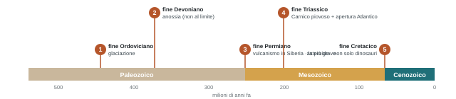
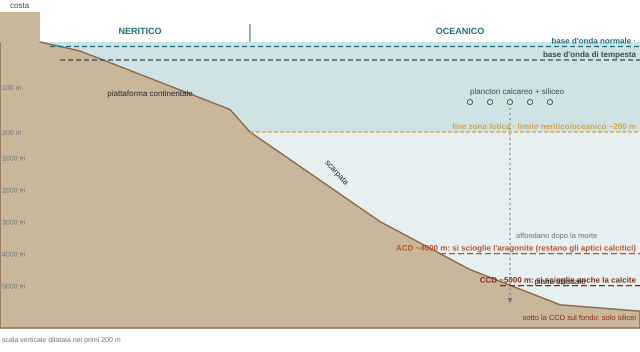

## Ripasso: geocronologia e cronostratigrafia

*Riprese dalle slide finali della volta scorsa.*

- **Geocronologia** ("l'orologio della Terra"): indica l'età o l'intervallo di un evento, con tecniche numeriche di datazione. Esempio: l'estinzione di fine Cretacico è avvenuta **66 Ma**, durante l'*età* Maastrichtiana.
- **Cronostratigrafia**: tutti i metodi di datazione relativa, le relazioni temporali tra rocce, gli eventi globali usati come marker (i GSSP). Esempio: durante tutta la *serie* del Cretacico superiore i dinosauri hanno subito grandi crolli di biodiversità.
- Unità, dal più grande al più piccolo: eonotema / eone · eratema / era · sistema / periodo · serie / epoca · piano / età.

:::esame{etichetta="Consiglio"}
Imparare l'ordine, dal più antico al più giovane, di eonotemi, eratemi, sistemi e serie. I piani sono la risoluzione più alta: per NAT non sono fondamentali, per GEO torneranno per tutti i cinque anni. Se un collega dice "sto studiando un sedimento del Miocene", tutti devono sapere che non è roba di 300 milioni di anni fa: il Miocene inizia a 23 Ma. **\[ndr\]** In aula si è sentito "e finisce attorno ai 7": il Miocene finisce a **5,33 Ma**; 7,25 Ma è il passaggio Tortoniano–Messiniano.
:::

## A cosa servono i fossili

*Perché passare un intero semestre e mezzo a guardare quasi 1500 fossili. Tre grandi temi.*

### 1 · Evoluzione ed estinzioni

Dai fossili si ricostruiscono i rami evolutivi e quali strategie morfologiche si sono rivelate vincenti. Ci sono organismi che hanno attraversato due, tre, quattro estinzioni di massa senza estinguersi, e altri spariti alla prima perturbazione; organismi con evoluzione rapida, che si adattano in fretta e vivono il cambiamento come un'opportunità, e altri con evoluzione lenta, che ne risentono pesantemente. Negli ultimi 500 milioni di anni ci sono esempi di tutte le categorie.

Oggi questo conta: siamo preoccupati per riscaldamento, deglaciazione, cambi delle correnti, anossia. La paleontologia guarda come gli organismi hanno reagito a glaciazioni, impatti di asteroidi, supernove, grandi eruzioni, anossie marine (che non sono fantascienza: l'Adriatico soffre periodicamente di anossia da lieve a forte). Esempio: nell'**Eocene** le temperature erano molto più alte di oggi, e si può usare come **proxy** per immaginare come reagiranno gli stessi gruppi.

:::nota{etichetta="In escursione (aprile–maggio)"}
Rocce dell'Eocene medio, deposte in acque prossimali e sottili, con coralli, ricci di mare, alghe e molluschi in quantità industriale. Con gli eventi ipertermali i coralli scompaiono, crollano molluschi e alghe, e arrivano i **protisti** (organismi unicellulari meglio adattati) che fanno "barriere coralline senza coralli". Con l'aumento delle precipitazioni l'acqua diventa torbida e prendono il sopravvento i **molluschi filtratori**. **\[ndr\]** In aula "tra i 30 e i 40 milioni di anni": l'Eocene medio va da circa 48 a 38 Ma.
:::

#### L'esempio delle trilobiti

Artropodi segmentati che camminavano sul fondale, con antenne, occhi e zampe, e che si appallottolavano come i porcellini di terra. Si sviluppano ed evolvono per tutto il **Paleozoico**; l'albero evolutivo per sottordini ("come tante famiglie di parenti") mostra due cose:

- **Fine Ordoviciano** (~444 Ma): una forte **glaciazione** distrugge gli organismi degli ambienti prossimali. I tre gruppi più prossimali (Asaphida, Agnostida e Ptychopariida) si estinguono; gli altri, più profondi, sopravvivono.
- **Verso la fine del Devoniano** (non al limite Devoniano–Carbonifero): lagune, piattaforme e ambienti prossimali soffrono un crollo drammatico dell'ossigeno. Muore chi vive sul fondale; si salva un solo gruppo, fatto di forme piccole, a carapace sottile e in gran parte cavo, probabilmente capaci di "saltare" nella colonna d'acqua e uscire dalle sacche anossiche. Il ragionamento del prof: noi galleggiamo non perché nuotiamo bene, ma perché la nostra densità è simile a quella dell'acqua (un respiro e saliamo, un'espirazione e scendiamo). Le trilobiti grandi del Devoniano, fino a mezzo metro, con carapace pesante e ricco di calcite, erano più dense e stavano sul fondo; quelle piccole e leggere potevano variare la densità. La prova sta nelle **tracce fossili**: fino a quel momento le trilobiti ne lasciano ovunque (camminano, scavano, si infossano, si riposano, "sembra via XX Settembre sotto Natale"); dal Devoniano sommitale si trovano ancora trilobiti di quel gruppo, ma **non più tracce**. Hanno imparato a nuotare. Lo stesso ragionamento delle code dei dinosauri della prima lezione.

#### Le Big Five

Immagine famosa, pubblicata a metà anni '60, che mostra il numero di famiglie marine nel Fanerozoico. Lo stesso andamento si vede in ambiente continentale e transizionale, e usando specie, generi o ordini.

- **3 · fine Permiano**: la più devastante, con il crollo più importante in ambiente marino. Grandi eruzioni alle alte latitudini, in **Siberia**, che sconvolgono la circolazione oceanica.
- **4 · fine Triassico**: la più piccola, ma con almeno due o tre impulsi. L'**evento pluviale del Carnico** (il Carnico è il primo piano del Triassico superiore): piogge enormi, grandi volumi di sedimento davanti ai delta, velocità di sedimentazione altissime. Poi, a fine Triassico, si lacera il **proto-Atlantico**: prima piccoli mari epicontinentali, poi l'apertura vera, con risalita di materiale e chimismo mantellico che uccide chi era sopravvissuto. Un **mare epicontinentale** è un braccio di mare che entra sopra un continente, come l'Adriatico.
- **5 · fine Cretacico**: di importanza relativamente bassa, "nonostante Hollywood". Non è definita dall'estinzione dei grandi rettili, ma da quella di molti altri organismi che risentono peggio dell'impatto e ne segnano con più precisione il momento e la reazione a catena.

:::esame
Domanda tipica soprattutto per GEO, che vedrà le estinzioni una per una. Non dire che la più importante è la numero 5: è la numero 3.
:::

### 2 · Paleobiogeografia

Sapere dove oggi si trova fossile un gruppo dice molto. Le stesse trilobiti si trovano nelle Alpi Carniche e vicino a Cagliari: oggi vicine, ma nel Paleozoico medio–superiore erano due linee di costa del Gondwana separate da un oceano. Allo stesso modo, gruppi di resti vegetali coevi trovati in continenti oggi lontanissimi dicono che allora quei continenti erano uniti.

### 3 · Paleoambienti

Davanti a un sasso, all'esame, bisogna raccontarne tutta la storia: chi c'è, che ambiente, come interagivano, se sono legati a un intervallo di tempo preciso.

:::definizione{etichetta="L'esempio della prima slide"}
La ricostruzione mostra un grande "fiore" rosso: è un **crinoide**, antenato dei gigli di mare, del gruppo degli **echinodermi** (quello dei ricci di mare e delle stelle). Per tutto il Paleozoico sono loro a fare la biodiversità degli echinodermi, con una spiccata **simmetria pentamera** nello stelo, nella corona e nelle braccia (pinnule). Interi sono rarissimi e costosissimi: lo stelo è fatto di articoli di calcite tenuti insieme solo da materia organica, e dopo la morte si sbriciola in un tappeto di frammenti bianchi, spesso pentagonali. Rocce fatte quasi solo di questi frammenti si chiamano **encriniti**.

Lettura: se i frammenti sono disarticolati e fuori posizione, l'ambiente aveva alta energia, oppure qualcuno camminava sul fondale e rimescolava il sedimento (ecco la trilobite). Il crinoide è girato nella corrente: ambiente con corrente. La trilobite poggia su un **corallo tabulato**, corallo paleozoico senza setti, solo coloniale, che diventa gigantesco. Tabulati e rugosi sono "cugini" delle Scleractinia attuali.
:::

Tra un paio di settimane, alla prima esercitazione sui **principi di fossilizzazione**, ci saranno circa 60 cassetti con 10–15 fossili ciascuno: non servirà riconoscere ogni organismo, ma capire come si è fossilizzato.

#### La griglia di riconoscimento

Dai libri di testo, tratta da un testo italiano del 2001: rappresenta il ragionamento d'esame. Si può partire dai **dati biotici** (quali fossili, profondi o superficiali, trasportati, ben o mal conservati) oppure renderli complementari ai **dati abiotici** (che roccia è, che struttura, superfici di sfaldatura o frattura, colore). Per questo accanto a Paleontologia ci sono le geologie, e per NAT è molto utile dare Mineralogia prima. Saper riconoscere la roccia aiuta tantissimo: su un basalto non si conserva una foglia; un "corallo carbonificato" non esiste.

## Gli ambienti della fossilizzazione

*Ci sono ambienti che permettono una fossilizzazione molto più rapida, abbondante e accurata. La rapidità è la questione principale: un organismo si fossilizza solo se viene seppellito in fretta.*

Il cinghiale morto nel bosco: la parte organica si decompone, qualcuno se lo mangia, insetti e altri si portano via il resto, le ossa vengono rotte, rosicchiate (con segni di morso, *bite marks*), disperse. Difficile trovare lo scheletro in connessione. Seppellito 5 metri sotto terra la probabilità cresce molto, ma in un bosco è un caso rarissimo. Molto più facile seppellire in fretta in **ambiente marino**: per questo il 90% dei fossili del corso sono marini, come in tutti i corsi base di paleontologia del mondo. Più quelli che dopo la morte **arrivano** in mare: tronchi e foglie (dopo una mareggiata la spiaggia è piena di tronchi).

L'ambiente marino permette un seppellimento **rapido, accurato e completo** (l'organismo non si disperde e non si disarticola) perché in mare aperto il sedimento è fine, fango: tomba completamente il resto e riduce l'attività batterica, fino a conservare in alcune condizioni anche le **parti molli**.

| Ambiente | Potenziale di fossilizzazione |
| --- | --- |
| Marino aperto | Alto: sedimento fine, seppellimento rapido. Gli oceani coprono gran parte del pianeta: per questo i fossili marini sono i più abbondanti |
| Delta fluviale | Ottimo: altissimo tasso di sedimentazione, sedimento fine. La parte del sistema fluviale che conserva meglio |
| Fiumi di pianura | Buono, ma limitato |
| Torrenti montani | Scarso: ciottoli grandi che non tombano, energia alta che rompe gusci e scheletri |
| Laghi | Alto: sedimenti fini come in mare, ma con chimismo diverso. Sono pochi rispetto agli oceani |
| Ghiacciai | Possibile (crioconservazione), ma al massimo pochi milioni di anni: un pezzo di mammut sì, il T. rex no |
| Deserti | Alto potenziale, preservazione scarsa: i processi alterano la mineralogia. Tipici i **legni silicizzati** (Nord America, Miocene): vento e sabbia silicea sostituiscono cellulosa e lignina con silice. Duri, belli, economici ai mercatini, ma non è più legno |

:::nota{etichetta="Sulla definizione di fossile"}
Nei vecchi testi italiani "fossile" è tutto ciò che ha più di 10.000 anni. È una definizione abbandonata: gli organismi morti di recente hanno una grande valenza paleontologica, e un'intera branca, la conservation paleobiology, studia proprio quelli.
:::

## Piattaforme continentali e carbonatiche

La piattaforma continentale arriva di norma a 150–170 m, al massimo 200; poi la pendenza aumenta (scarpata), con pendenze di pochi gradi ma sufficienti per i fenomeni gravitativi; oltre i 3–5000 m le piane abissali, perfettamente piane. Va caratterizzata la colonna d'acqua, perché le sue caratteristiche fisico-chimiche determinano quali fossili si trovano.

Oggi le piattaforme sono le fasce turchesi lungo le coste, più il **triangolo dei coralli** (tra Indonesia, Filippine e Pacifico occidentale), l'area con la più alta biodiversità attuale, favorita dai mari superficiali. Nel **Cretacico** le piattaforme erano molto più estese: zone gonfie di organismi che producono carbonato di calcio (coralli, spugne, protozoi, molluschi, echinodermi) e che vengono seppelliti in fretta.

:::esame{etichetta="Da ricordare"}
Quando si ricostruisce un paleoambiente non basta dire "è un corallo, quindi zona fotica": bisogna tener conto anche del periodo. Giurassico e Cretacico sono il massimo di estensione delle piattaforme carbonatiche.
:::

**Conseguenza: gli idrocarburi.** Enorme produzione di materia organica dentro sedimenti marini. Dove il sedimento è sabbioso c'è porosità (il serbatoio, *reservoir*); dove è argilloso l'argilla fa da tappo. L'idrocarburo, meno denso, risale finché trova una roccia impermeabile. Basta che il livello del mare oscilli per creare una "lasagna" di sabbie produttive e argille di tappo. Quelle aree oggi sono grandi riserve.

Sulla mappa del Cretacico inferiore l'Atlantico è già in parte aperto, con una dorsale, anche se non come oggi. L'India, ancora lontana, urterà l'Asia qualche decina di milioni di anni dopo; intorno a 66 Ma è dalla parte opposta rispetto al punto d'impatto dell'asteroide, e le rocce dell'India nord-occidentale di quell'età sono tutte vulcaniche, i **Deccan Traps** ("trap" indica abbondanti effusioni), interpretati come rimbalzo dell'impatto. L'Australia è ancora attaccata all'Antartide. L'Europa è un mosaico di piccoli oceani, mari e piattaforme carbonatiche, che continuano per buona parte del Paleocene e dell'Eocene.

#### Piattaforme carbonatiche in Italia

- **Dolomiti**: una piattaforma carbonatica dal Triassico a buona parte del Giurassico. Strati più sabbiosi e più argillosi alternati, pieni di fossili che hanno prodotto il carbonato di calcio di cui sono fatte, in acque basse, ad alta energia, ben ossigenate e illuminate.
- **Appennino**, ad esempio il Gran Sasso (con la galleria e il laboratorio sotterraneo): piattaforme di decine di chilometri.
- **Liguria di ponente**: da Ventimiglia in su, Grammondo, Argentera, sopra Nizza e Mentone, i **Balzi Rossi** (la grotta con l'uomo preistorico scavata nel Giurassico). Rocce piene di coralli, spugne, molluschi, in poca acqua, con una sabbia bianca a granuli sferici. Sarà una tappa dell'escursione.

#### Tipi di piattaforma carbonatica (non nelle dispense, non essenziale per l'esame)

| Tipo | Caratteristiche |
| --- | --- |
| Rampa | Fino a ~100 km, pendenza continua: ottima differenziazione ecologica lungo il gradiente batimetrico. Sotto costa organismi adattati a onde, energia e luce; più al largo meno luce e meno energia, ecologie diverse |
| Piattaforma s.s. | Arriva a una certa profondità e resta piatta e continua |
| Piattaforma orlata | Come sopra, resta nella zona fotica per centinaia di km, ma con un **orlo** (mound) biocostruito nella zona dei frangenti, con coralli robusti. L'orlo blocca le onde: dietro si formano **lagune** carbonatiche di decine di km, a sedimento fine e grande biodiversità |
| Epicontinentale | Migliaia di km. Esempio: il **Western Interior Seaway** del Nord America (in aula "Western Interior Basin"), mare superficiale ricchissimo di vita e di apporti fluviali; oggi una delle regioni a più alta produzione di idrocarburi |
| Isolata (pelagica) | In mezzo al mare, biocostruzioni enormi su un alto. Tipica dell'Italia centrale: Gran Sasso, Maiella, molte catene tra Emilia-Romagna, Toscana, Umbria, Marche |

## Le zone del mare

### Neritico e oceanico

Il dominio **neritico** arriva a circa 200 m e risente ancora degli apporti continentali (delta, ambienti prossimali, spiagge sommerse, piattaforme). L'**oceanico** li perde: produzione carbonatica per precipitazione, nessun apporto detritico. Su una rampa blanda il neritico è esteso; su una piattaforma isolata è minuscolo.

### La luce: perché i 200 m contano

Entro circa 200 m, in acque cristalline, arriva la luce fotosinteticamente attiva. Lo spettro si perde con la profondità: oltre i 100 m restano verde e blu, oltre un paio di centinaia di metri il buio. Il grosso della fotosintesi avviene nei primi metri, fino a circa 100; a 200 m ci arrivano pochissimi organismi. Quindi **sopra i 200 m** si riconoscono bene i gruppi; **sotto**, dire se un fossile stava a 2000 o a 5000 m non è facile, salvo l'eccezione della CCD.

### Bentonico e pelagico

**Dominio bentonico**: tutti gli organismi che stanno sul fondale, a un metro come a 11.000. **Dominio pelagico**: quelli della colonna d'acqua, che nuotano attivamente (il tonno) o vengono trasportati passivamente (il plancton).

### La CCD

:::definizione
**Profondità di compensazione del carbonato di calcio (CCD**, *Carbonate Compensation Depth*): la profondità sotto la quale, per le condizioni chimiche dell'acqua, il carbonato di calcio non precipita più e quello esistente si scioglie. Mediamente tra **4000 e 5000 m**; in ambienti con correnti particolari (ad esempio antartici) può risalire, raramente scende sotto i 5000.

Il carbonato di calcio esiste come **calcite** e come **aragonite**, meno stabile: l'aragonite si perde già dai ~4000 m, la calcite sicuramente dai ~5000.
:::

- Un organismo **bentonico** con guscio carbonatico può vivere solo sopra i 4000 m circa: mai sotto i 5000.
- Un **planctonico** vive nei primi metri anche sopra un fondale di 7000 m. Quando muore affonda: oltre i 5000 m il suo guscio carbonatico si scioglie in giorni o mesi, a seconda delle dimensioni.
- Plancton calcareo e siliceo vivono insieme e decantano insieme. Fondale a 1000 m: si trovano entrambi. Fondale a 7000 m: **solo i silicei**. Non perché ci fosse solo plancton siliceo, ma perché il carbonato si è sciolto.
- **Solo silicei** → sotto la CCD. **Calcarei e silicei insieme**, o solo calcarei → sopra i 4–5000 m.

:::nota{etichetta="Ammoniti e aptici"}
Il guscio delle ammoniti è **aragonitico**; le due "valve" che chiudevano l'apertura, gli **aptici**, sono **calcitici**. Nell'Appennino toscano ci sono depositi formati tra 4000 e 5000 m dove si trovano solo aptici, a palate: la finestra in cui l'aragonite si è già sciolta e la calcite non ancora. C'è perfino un nome di formazione, i **Calcari a Saccocoma e Aptici** (*Saccocoma* è un piccolo echinoderma pelagico del Giurassico superiore. **\[ndr\]** In aula è stato descritto come "un riccio di mare pelagico": è in realtà un **crinoide**, cioè un giglio di mare, capace di nuotare).

Eccezioni possibili sotto la CCD: un blocco con ammoniti già fossilizzate portato giù da una frana sottomarina e subito tombato; oppure i **coproliti** (escrementi fossili) di grandi cetacei, che possono contenere particelle carbonatiche ben isolate dai fluidi.
:::

:::esame
Domanda frequente. Ma non dire che un corallo di 10 m di profondità "sta sopra la CCD": è vero, ma la risoluzione è molto più alta. Faceva fotosintesi: zona fotica, primi 100 m, al massimo 200.
:::

### Energia e granulometria: base d'onda e di tempesta

L'energia del moto ondoso è massima sotto costa (i cavalloni si rompono vicino a riva). Il sedimento lo registra: più i grani sono grossi, più il moto ondoso era intenso. Gradiente granulometrico: grossolano negli ambienti prossimali, sempre più fine verso il largo (le spiagge ciottolose del levante genovese contro quelle sabbiose di ponente; ma anche lì, nuotando al largo, il fondo diventa più fine e fangoso).

- **Base d'onda** (normale): la profondità sotto la quale il sedimento non è interessato dal moto ondoso con tempo normale.
- **Base d'onda di tempesta**: più profonda, perché durante le tempeste il moto ondoso penetra di più. Tra le due, substrati di solito fini, toccati solo durante le tempeste.

Per gli organismi **infaunali** (che si infossano) serve un substrato sabbioso fine: in un substrato roccioso o ciottoloso bisogna scavare il sasso.

### Le piane tidali: il gradiente al contrario

Con le escursioni di marea l'energia massima non è sotto costa: la marea che sale accelera e arriva al punto più alto con energia minima, poi riscende. Quindi la parte **prossimale è fangosa** e la granulometria **aumenta** allontanandosi. Camminare in una piana di marea è "brutto: fango, puzza, ti infogni fino al ginocchio"; per salvarsi si va verso il mare. I raccoglitori di vongole dell'alto Adriatico arrivano dal mare in barca e scendono sui primi banchi sabbiosi duri, perché da terra dovrebbero attraversare l'intertidale fangoso. Finita la zona di marea, ricomincia il gradiente normale.

:::esame{etichetta="Da ricordare"}
Organismo in un substrato fangoso: si può pensare a un ambiente tidale. Nel tidale il fangoso è prossimale, il sabbioso è distale.
:::

### Mare profondo e torbiditi

Ambienti capaci di fossili eccezionali e abbondanti, legati a sorgenti di sedimento particolari: canyon e delta che accumulano materiale finché, per uno shock sismico o perché l'angolo di riposo è superato, il sedimento parte. Questi flussi gravitativi corrono per decine o centinaia di chilometri sui fondali, e possono essere così densi (raccolgono fango e argilla dal fondo) da rompere i cavi del telegrafo, oggi quelli di comunicazione: sono le **correnti di torbida** (GEO ci farà almeno quattro ore). Sembrano lontane, ma la passeggiata di Nervi, il Monte Fasce, il Monte Moro, il litorale fino a Zoagli e parti del promontorio di Portofino sono fatti di sedimenti di mare profondo del **Cretacico superiore**, frane sottomarine sovrapposte, pieni di fossili: la "lasagna" verticalizzata vista la volta scorsa.

### I fattori ambientali: come leggere lo schema

Lo schema che va dalla costa al largo disegna la luce sempre più importante con la profondità. Non indica la **quantità** di luce, ma quanto la luce è un **fattore limitante**. Sotto costa c'è tanta luce: chi la vuole la usa (coralli), chi non la vuole sta lì comunque (molluschi). In profondità la luce non c'è, e non si può mettere nulla che ne abbia bisogno. Lo stesso vale per **ossigeno**, **cibo** e **salinità**: sotto costa la salinità varia moltissimo (in una pozza di marea che evapora si passa dal 30‰ a circa il 40‰), e un organismo sensibile ai cambi di salinità lì non ci può stare. Un corallo "nella CCD" non è sbagliato per il carbonato, ma là sotto non c'è luce, c'è il problema del cibo e molto altro.

## Come descrivere un organismo

*Le crocette delle schede d'esercitazione: rispondono direttamente alle domande d'esame. Ogni foglio ha sei riquadri per disegnare fino a sei fossili; di solito non ci saranno più di sei gruppi da riconoscere (per i coralli, quattro gruppi, uno per gruppo basta).*

| Stile di vita | Definizione | Per chi vale |
| --- | --- | --- |
| Planctonico | Vive nella massa d'acqua, trasportato **passivamente** | Pelagici |
| Nectonico | Si sposta **attivamente** nella massa d'acqua (pesce, ammonite) | Pelagici |
| Bentonico | Vive sul fondo | poi si specifica ↓ |
| · Epifaunale / infaunale / semi-infaunale | sopra il fondale / dentro il fondale / in parte dentro | Solo bentonici |
| · Vagile / sessile | si muove (non deve correre: la stella marina) / ancorato al substrato | Solo bentonici |

:::esame{etichetta="Errore da evitare"}
Epifaunale, infaunale, sessile e vagile valgono **solo per i bentonici**. Dire "nectonico vagile" di un pesce o di un'ammonite è ridondante: se è nectonico si muove per definizione. Il neustonico (che vive alla superficie dell'acqua) lo si lascia stare: fossile è rarissimo.
:::

#### Trofismo

Autotrofi, eterotrofi, mixotrofi. Poi il ruolo: produttore primario; sedimentivoro / limivoro / erbivoro; filtratore; sospensivoro; necrofago; predatore (e superpredatore). La piramide alimentare va da chi non ha bisogno praticamente di nulla, a chi è contento con due foglie di insalata, ai filtratori e sospensivori (epifaunali, infaunali superficiali e profondi), ai carnivori. In un campione ci possono essere più resti, un infaunale, un epifaunale e il resto di un predatore: da lì si ricostruisce l'ecologia.

:::esame
Si chiede di ricostruire una **catena trofica** per quell'ambiente. A volte si può, a volte si ferma presto (con una sola alga rossa non si racconta tutta la storia). Quasi sempre è marina; GEO vedrà anche le piramidi continentali nella storia della vita sulla Terra.
:::

## Dalle slide, non spiegate in aula

Probabilmente verranno riprese più avanti. Riporto solo quello che le slide dicono esplicitamente.

- **Salinità dell'acqua**: dolce < 0,5‰ · salmastra 0,5–30‰ · salata 30–50‰ · salamoia > 50‰.
- **Isotopi dell'ossigeno**: il rapporto tra i due isotopi stabili, 16O e 18O, con cui l'ossigeno precipita in carbonati e fosfati, registra in dettaglio le variazioni di temperatura dell'oceano e di volume dei ghiacci. I due effetti si separano confrontando gli isotopi in microfossili coevi planctonici e bentonici, soprattutto foraminiferi.
- **Isotopi del carbonio**: l'abbondanza relativa di 12C e 13C in carbonati e materia organica varia nel tempo, per i cambiamenti nei flussi del ciclo del carbonio: apporti di carbonio terrestre e ossidazione della materia organica marina in entrata, produzione e seppellimento di carbonati e materia organica marina in uscita.

## Da fare

- [ ] Imparare l'ordine di eonotemi, eratemi, sistemi e serie (GEO: anche i piani).
- [ ] Memorizzare le Big Five con la causa di ciascuna, e quale è la più grave.
- [ ] Ridisegnare la sezione del margine marino: neritico/oceanico, zona fotica, base d'onda e di tempesta, ACD e CCD.
- [ ] Fissare il gradiente granulometrico normale e quello invertito delle piane tidali.
- [ ] Ripassare la tabella degli stili di vita e il trofismo: è la griglia delle crocette delle esercitazioni.

### Prossimi appuntamenti

Venerdì 2 ottobre niente lezione. Giovedì 8 e venerdì 9 ottobre lezioni **solo GEO** (sistematica ed evoluzione, biozone e fossili guida). Dal 15–16 ottobre, per tutti, fossilizzazione e trasporto con la prima esercitazione sui cassetti.
